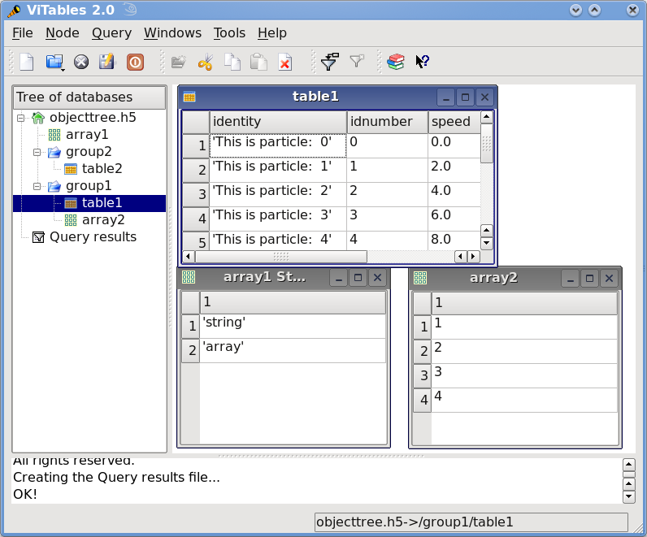

Introduction
============
.. epigraph::

    La sabiduría no vale la pena si no es posible servirse de ella para
    inventar una nueva manera de preparar los garbanzos.

    [Wisdom isn't worth anything if you can't use it to come up with a new
    way to cook garbanzos.]

    -- Gabriel García Márquez, A wise Catalan in *"Cien años de soledad"*

The goal of PyTables is to enable the end user to manipulate easily data
*tables* and *array* objects in a hierarchical structure. The foundation of
the underlying hierarchical data organization is the excellent HDF5 library
(see :ref:`[HDGF1] <HDFG1>`).

It should be noted that this package is not intended to serve as a complete
wrapper for the entire HDF5 API, but only to provide a flexible, *very
pythonic* tool to deal with (arbitrarily) large amounts of data (typically
bigger than available memory) in tables and arrays organized in a
hierarchical and persistent disk storage structure.

A table is defined as a collection of records whose values are stored in
*fixed-length* fields. All records have the same structure and all values in
each field have the same *data type*. The terms *fixed-length* and strict
*data types* may seem to be a strange requirement for an interpreted language
like Python, but they serve a useful function if the goal is to save very
large quantities of data (such as is generated by many data acquisition
systems, Internet services or scientific applications, for example) in an
efficient manner that reduces demand on CPU time and I/O.

In order to emulate in Python records mapped to HDF5 C structs PyTables
implements a special class so as to easily define all its fields and other
properties. PyTables also provides a powerful interface to mine data in
tables. Records in tables are also known in the HDF5 naming scheme as
*compound* data types.

For example, you can define arbitrary tables in Python simply by declaring a
class with named fields and type information, such as in the following
example::

    class Particle(IsDescription):
        name      = StringCol(16)   # 16-character String
        idnumber  = Int64Col()      # signed 64-bit integer
        ADCcount  = UInt16Col()     # unsigned short integer
        TDCcount  = UInt8Col()      # unsigned byte
        grid_i    = Int32Col()      # integer
        grid_j    = Int32Col()      # integer

        # A sub-structure (nested data-type)
        class Properties(IsDescription):
            pressure = Float32Col(shape=(2,3)) # 2-D float array (single-precision)
            energy   = Float64Col(shape=(2,3,4)) # 3-D float array (double-precision)

You then pass this class to the table constructor, fill its rows with your
values, and save (arbitrarily large) collections of them to a file for
persistent storage. After that, the data can be retrieved and post-processed
quite easily with PyTables or even with another HDF5 application (in C,
Fortran, Java or whatever language that provides a library to interface with
HDF5).

Other important entities in PyTables are *array* objects, which are analogous
to tables with the difference that all of their components are homogeneous.
They come in different flavors, like *generic* (they provide a quick and fast
way to deal with for numerical arrays), *enlargeable* (arrays can be extended
along a single dimension) and *variable length* (each row in the array can
have a different number of elements).

The next section describes the most interesting capabilities of PyTables.

Main Features
-------------
PyTables takes advantage of the object orientation and introspection
capabilities offered by Python, the powerful data management features of
HDF5, and NumPy's flexibility and Numexpr's high-performance manipulation of
large sets of objects organized in a grid-like fashion to provide these
features:

- *Support for table entities:* You can tailor your data adding or deleting
  records in your tables. Large numbers of rows (up to 2**63, much more than
  will fit into memory) are supported as well.

- *Multidimensional and nested table cells:* You can declare a column to
  consist of values having any number of dimensions besides scalars, which is
  the only dimensionality allowed by the majority of relational databases.
  You can even declare columns that are made of other columns (of different
  types).

- *Indexing support for columns of tables:*
  Very useful if you have large tables and you want to quickly look up for
  values in columns satisfying some criteria.

- *Support for numerical arrays:*
  NumPy (see :ref:`[NUMPY] <NUMPY>`) arrays can be used as a useful
  complement of tables to store homogeneous data.

- *Enlargeable arrays:* You can add new
  elements to existing arrays on disk in any dimension you want (but only
  one). Besides, you are able to access just a slice of your datasets by
  using the powerful extended slicing mechanism, without need to load all
  your complete dataset in memory.

- *Variable length arrays:* The number of elements in these arrays can vary
  from row to row. This provides a lot of flexibility when dealing with
  complex data.

- *Supports a hierarchical data model:*
  Allows the user to clearly structure all data. PyTables builds up an
  *object tree* in memory that replicates the underlying file data structure.
  Access to objects in the file is achieved by walking through and
  manipulating this object tree.
  Besides, this object tree is built in a lazy way, for efficiency purposes.

- *User defined metadata:* Besides
  supporting system metadata (like the number of rows of a table, shape,
  flavor, etc.) the user may specify arbitrary metadata (as for example, room
  temperature, or protocol for IP traffic that was collected) that complement
  the meaning of actual data.

- *Ability to read/modify generic HDF5 files:* PyTables can access a wide
  range of objects in generic HDF5 files, like compound type datasets (that
  can be mapped to Table objects), homogeneous datasets (that can be mapped
  to Array objects) or variable length record datasets (that can be mapped to
  VLArray objects). Besides, if a dataset is not supported, it will be mapped
  to a special UnImplemented class (see :ref:`UnImplementedClassDescr`), that
  will let the user see that the data is there, although it will be
  unreachable (still, you will be able to access the attributes and some
  metadata in the dataset). With that, PyTables probably can access and
  *modify* most of the HDF5 files out there.

- *Data compression:* Supports data compression (using the *Zlib*, *LZO*,
  *bzip2* and *Blosc* compression libraries) out of the box. This is
  important when you have repetitive data patterns and don't want to spend
  time searching for an optimized way to store them (saving you time spent
  analyzing your data organization).

- *High performance I/O:* On modern systems storing large amounts of data,
  tables and array objects can be read and written at a speed only limited by
  the performance of the underlying I/O subsystem. Moreover, if your data is
  compressible, even that limit is surmountable!

- *Support of files bigger than 2 GB:*
  PyTables automatically inherits this capability from the underlying HDF5
  library (assuming your platform supports the C long long integer, or, on
  Windows, __int64).

- *Architecture-independent:* PyTables has been carefully coded (as HDF5
  itself) with little-endian/big-endian byte ordering issues in mind. So, you
  can write a file on a big-endian machine (like a Sparc or MIPS) and read it
  on other little-endian machine (like an Intel or Alpha) without problems.
  In addition, it has been tested successfully with 64 bit platforms
  (Intel-64, AMD-64, PowerPC-G5, MIPS, UltraSparc) using code generated with
  64 bit aware compilers.

.. _ObjectTreeSection:

The Object Tree
---------------
The hierarchical model of the underlying HDF5 library allows PyTables to
manage tables and arrays in a tree-like structure. In order to achieve this,
an *object tree* entity is *dynamically* created imitating the HDF5 structure
on disk. The HDF5 objects are read by walking through this object tree. You
can get a good picture of what kind of data is kept in the object by
examining the *metadata* nodes.

The different nodes in the object tree are instances of PyTables classes.
There are several types of classes, but the most important ones are the Node,
Group and Leaf classes. All nodes in a PyTables tree are instances of the
Node class. The Group and Leaf classes are descendants of Node. Group
instances (referred to as *groups* from now on) are a grouping structure
containing instances of zero or more groups or leaves, together with
supplementary metadata. Leaf instances (referred to as *leaves*) are
containers for actual data and can not contain further groups or leaves. The
Table, Array, CArray, EArray, VLArray and UnImplemented classes are
descendants of Leaf, and inherit all its properties.

Working with groups and leaves is similar in many ways to working with
directories and files on a Unix filesystem, i.e. a node (file or directory)
is always a *child* of one and only one group (directory), its *parent group*
[1]_.
Inside of that group, the node is accessed by its *name*. As is the case with
Unix directories and files, objects in the object tree are often referenced
by giving their full (absolute) path names. In PyTables this full path can be
specified either as string (such as '/subgroup2/table3', using / as a
parent/child separator) or as a complete object path written in a format
known as the *natural name* schema (such as file.root.subgroup2.table3).

Support for *natural naming* is a key aspect of PyTables. It means that the
names of instance variables of the node objects are the same as the names of
its children [2]_. This is very *Pythonic* and intuitive in many cases. Check
the tutorial :ref:`readingAndSelectingUsage` for usage examples.

You should also be aware that not all the data present in a file is loaded
into the object tree. The *metadata* (i.e. special data that describes the
structure of the actual data) is loaded only when the user want to access to
it (see later). Moreover, the actual data is not read until she request it
(by calling a method on a particular node). Using the object tree (the
metadata) you can retrieve information about the objects on disk such as
table names, titles, column names, data types in columns, numbers of rows,
or, in the case of arrays, their shapes, typecodes, etc. You can also search
through the tree for specific kinds of data then read it and process it. In a
certain sense, you can think of PyTables as a tool that applies the same
introspection capabilities of Python objects to large amounts of data in
persistent storage.

It is worth noting that PyTables sports a *metadata cache system* that loads
nodes *lazily* (i.e. on-demand), and unloads nodes that have not been used
for some time (following a *Least Recently Used* schema). It is important to
stress out that the nodes enter the cache after they have been unreferenced
(in the sense of Python reference counting), and that they can be revived (by
referencing them again) directly from the cache without performing the
de-serialization process from disk. This feature allows dealing with files
with large hierarchies very quickly and with low memory consumption, while
retaining all the powerful browsing capabilities of the previous
implementation of the object tree. See :ref:`[OPTIM] <OPTIM>` for more facts
about the advantages introduced by this new metadata cache system.

To better understand the dynamic nature of this object tree entity, let's
start with a sample PyTables script (which you can find in
examples/objecttree.py) to create an HDF5 file::

    from tables import *

    class Particle(IsDescription):
        identity = StringCol(itemsize=22, dflt=" ", pos=0)  # character String
        idnumber = Int16Col(dflt=1, pos = 1)  # short integer
        speed    = Float32Col(dflt=1, pos = 2)  # single-precision

    # Open a file in "w"rite mode
    fileh = open_file("objecttree.h5", mode = "w")

    # Get the HDF5 root group
    root = fileh.root

    # Create the groups
    group1 = fileh.create_group(root, "group1")
    group2 = fileh.create_group(root, "group2")

    # Now, create an array in root group
    array1 = fileh.create_array(root, "array1", ["string", "array"], "String array")

    # Create 2 new tables in group1
    table1 = fileh.create_table(group1, "table1", Particle)
    table2 = fileh.create_table("/group2", "table2", Particle)

    # Create the last table in group2
    array2 = fileh.create_array("/group1", "array2", [1,2,3,4])

    # Now, fill the tables
    for table in (table1, table2):
        # Get the record object associated with the table:
        row = table.row

        # Fill the table with 10 records
        for i in xrange(10):
            # First, assign the values to the Particle record
            row['identity']  = 'This is particle: %2d' % (i)
            row['idnumber'] = i
            row['speed']  = i * 2.

            # This injects the Record values
            row.append()

        # Flush the table buffers
        table.flush()

    # Finally, close the file (this also will flush all the remaining buffers!)
    fileh.close()

This small program creates a simple HDF5 file called objecttree.h5 with the
structure that appears in :ref:`Figure 1 <objecttree-h5>` [3]_.
When the file is created, the metadata in the object tree is updated in
memory while the actual data is saved to disk. When you close the file the
object tree is no longer available. However, when you reopen this file the
object tree will be reconstructed in memory from the metadata on disk (this
is done in a lazy way, in order to load only the objects that are required by
the user), allowing you to work with it in exactly the same way as when you
originally created it.

.. _objecttree-h5:

    **Figure 1: An HDF5 example with 2 subgroups, 2 tables and 1 array.**

In :ref:`Figure2 <objecttree>`, you can see an example of the object tree
created when the above objecttree.h5 file is read (in fact, such an object
tree is always created when reading any supported generic HDF5 file).
It is worthwhile to take your time to understand it [4]_.
It will help you understand the relationships of in-memory PyTables objects.

.. _objecttree:

.. figure:: images/objecttree.*
    :width: 100%
    :align: center

    **Figure 2: A PyTables object tree example.**

---------------------------

.. [1] PyTables does not support hard links - for the moment.

.. [2] I got this simple but powerful idea from the excellent Objectify
       module by David Mertz (see :ref:`[MERTZ] <MERTZ>`).

.. [3] We have used ViTables (see :ref:`[VITABLES] <VITABLES>`) in order to
       create this snapshot.

.. [4] Bear in mind, however, that this diagram is *not* a standard UML class
       diagram; it is rather meant to show the connections between the
       PyTables objects and some of its most important attributes and
       methods.

