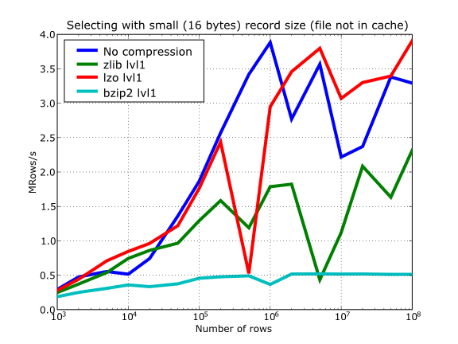
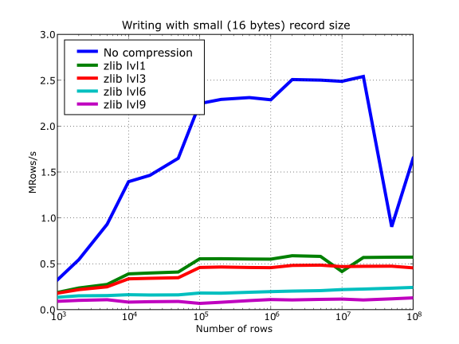

Optimization tips
=================
.. epigraph::

    ... durch planmässiges Tattonieren.

    [... through systematic, palpable experimentation.]

    -- Johann Karl Friedrich Gauss [asked how he came upon his theorems]

.. currentmodule:: tables

On this chapter, you will get deeper knowledge of PyTables internals.
PyTables has many tunable features so that you can improve the performance of
your application.  If you are planning to deal with really large data, you
should read carefully this section in order to learn how to get an important
efficiency boost for your code.  But if your datasets are small (say, up to
10 MB) or your number of nodes is contained (up to 1000), you should not
worry about that as the default parameters in PyTables are already tuned for
those sizes (although you may want to adjust them further anyway).  At any
rate, reading this chapter will help you in your life with PyTables.

Understanding chunking
----------------------
The underlying HDF5 library that is used by PyTables allows for certain
datasets (the so-called *chunked* datasets) to take the data in bunches of a
certain length, named *chunks*, and write them on disk as a whole, i.e. the
HDF5 library treats chunks as atomic objects and disk I/O is always made in
terms of complete chunks.  This allows data filters to be defined by the
application to perform tasks such as compression, encryption, check-summing,
etc. on entire chunks.

HDF5 keeps a B-tree in memory that is used to map chunk structures on disk.
The more chunks that are allocated for a dataset the larger the B-tree.
Large B-trees take memory and cause file storage overhead as well as more
disk I/O and higher contention forthe metadata cache.  Consequently, it's
important to balance between memory and I/O overhead (small B-trees) and time
to access data (big B-trees).

In the next couple of sections, you will discover how to inform PyTables
about the expected size of your datasets for allowing a sensible computation
of the chunk sizes.  Also, you will be presented some experiments so that you
can get a feeling on the consequences of manually specifying the chunk size.
Although doing this latter is only reserved to experienced people, these
benchmarks may allow you to understand more deeply the chunk size
implications and let you quickly start with the fine-tuning of this important
parameter.

.. _expectedRowsOptim:

Informing PyTables about expected number of rows in tables or arrays
~~~~~~~~~~~~~~~~~~~~~~~~~~~~~~~~~~~~~~~~~~~~~~~~~~~~~~~~~~~~~~~~~~~~
PyTables can determine a sensible chunk size to your dataset size if you
helps it by providing an estimation of the final number of rows for an
extensible leaf [1]_.  You should provide this information at leaf creation
time by passing this value to the expectedrows argument of the
:meth:`File.create_table` method or :meth:`File.create_earray` method (see
:ref:`EArrayClassDescr`). For VLArray leaves, you must pass the expected size
in MBytes by using the argument expectedsizein MB of
:meth:`File.create_vlarray` (see :ref:`VLArrayClassDescr`) instead.

When your leaf size is bigger than 10 MB (take this figure only as a
reference, not strictly), by providing this guess you will be optimizing the
access to your data.  When the table or array size is larger than, say 100MB,
you are *strongly* suggested to provide such a guess; failing to do that may
cause your application to do very slow I/O operations and to demand *huge*
amounts of memory. You have been warned!

.. _chunksizeFineTune:

Fine-tuning the chunksize
~~~~~~~~~~~~~~~~~~~~~~~~~
.. warning::

    This section is mostly meant for experts.  If you are a beginner, you
    must know that setting manually the chunksize is a potentially dangerous
    action.

Most of the time, informing PyTables about the extent of your dataset is
enough.  However, for more sophisticated applications, when one has special
requirements for doing the I/O or when dealing with really large datasets,
you should really understand the implications of the chunk size in order to
be able to find the best value for your own application.

You can specify the chunksize for every chunked dataset in PyTables by
passing the chunkshape argument to the corresponding constructors. It is
important to point out that chunkshape is not exactly the same thing than a
chunksize; in fact, the chunksize of a dataset can be computed multiplying
all the dimensions of the chunkshape among them and multiplying the outcome
by the size of the atom.

We are going to describe a series of experiments where an EArray of 15 GB is
written with different chunksizes, and then it is accessed in both sequential
(i.e. first element 0, then element 1 and so on and so forth until the data
is exhausted) and random mode (i.e. single elements are read randomly all
through the dataset). These benchmarks have been carried out with
PyTables 2.1 on a machine with an Intel Core2 processor @ 3 GHz and a RAID-0
made of two SATA disks spinning at 7200 RPM, and using GNU/Linux with an XFS
filesystem.  The script used for the benchmarks is available in
bench/optimal-chunksize.py.

In figures :ref:`Figure 1 <createTime-chunksize>`,
:ref:`Figure 2 <fileSizes-chunksize>`, :ref:`Figure 3 <seqTime-chunksize>`
and :ref:`Figure 4 <randomTime-chunksize>`, you can see how the chunksize
affects different aspects, like creation time, file sizes, sequential read
time and random read time.  So, if you properly inform PyTables about the
extent of your datasets, you will get an automatic chunksize value (256 KB in
this case) that is pretty optimal for most of uses.  However, if what you
want is, for example, optimize the creation time when using the
Zlib compressor, you may want to reduce the chunksize to 32 KB (see
:ref:`Figure 1 <createTime-chunksize>`). Or, if your goal is to optimize the
sequential access time for an dataset compressed with Blosc, you may want to
increase the chunksize to 512 KB (see :ref:`Figure 3 <seqTime-chunksize>`).

You will notice that, by manually specifying the chunksize of a leave you
will not normally get a drastic increase in performance, but at least, you
have the opportunity to fine-tune such an important parameter for improve
performance.

.. _createTime-chunksize:

    **Figure 1. Creation time per element for a 15 GB EArray and different
    chunksizes.**

.. _fileSizes-chunksize:

    **Figure 2. File sizes for a 15 GB EArray and different chunksizes.**

.. _seqTime-chunksize:

    **Figure 3. Sequential access time per element for a 15 GB EArray and
    different chunksizes.**

.. _randomTime-chunksize:

    **Figure 4. Random access time per element for a 15 GB EArray and
    different chunksizes.**

Finally, it is worth noting that adjusting the chunksize can be specially
important if you want to access your dataset by blocks of certain dimensions.
In this case, it is normally a good idea to set your chunkshape to be the
same than these dimensions; you only have to be careful to not end with a too
small or too large chunksize.  As always, experimenting prior to pass your
application into production is your best ally.

.. _searchOptim:

Accelerating your searches
--------------------------

.. note::

    Many of the explanations and plots in this section and the forthcoming
    ones still need to be updated to include Blosc (see
    :ref:`[BLOSC] <BLOSC>`), the new and powerful compressor added in
    PyTables 2.2 series.  You should expect it to be the fastest compressor
    among all the described here, and its use is strongly recommended
    whenever you need extreme speed and not a very high compression ratio.

Searching in tables is one of the most common and time consuming operations
that a typical user faces in the process of mining through his data.  Being
able to perform queries as fast as possible will allow more opportunities for
finding the desired information quicker and also allows to deal with larger
datasets.

PyTables offers many sort of techniques so as to speed-up the search process
as much as possible and, in order to give you hints to use them based, a
series of benchmarks have been designed and carried out.  All the results
presented in this section have been obtained with synthetic, random data and
using PyTables 2.1.  Also, the tests have been conducted on a machine with an
Intel Core2 (64-bit) @ 3 GHz processor with RAID-0 disk storage (made of four
spinning disks @ 7200 RPM), using GNU/Linux with an XFS filesystem.  The
script used for the benchmarks is available in bench/indexed_search.py.
As your data, queries and platform may be totally different for your case,
take this just as a guide because your mileage may vary (and will vary).

In order to be able to play with tables with a number of rows as large as
possible, the record size has been chosen to be rather small (24 bytes). Here
it is its definition::

    class Record(tables.IsDescription):
        col1 = tables.Int32Col()
        col2 = tables.Int32Col()
        col3 = tables.Float64Col()
        col4 = tables.Float64Col()

In the next sections, we will be optimizing the times for a relatively
complex query like this::

    result = [row['col2'] for row in table if (
              ((row['col4'] >= lim1 and row['col4'] < lim2) or
              ((row['col2'] > lim3 and row['col2'] < lim4])) and
              ((row['col1']+3.1*row['col2']+row['col3']*row['col4']) > lim5)
              )]

(for future reference, we will call this sort of queries *regular* queries).
So, if you want to see how to greatly improve the time taken to run queries
like this, keep reading.

.. _inkernelSearch:

In-kernel searches
~~~~~~~~~~~~~~~~~~
PyTables provides a way to accelerate data selections inside of a single
table, through the use of the :ref:`TableMethods_querying` iterator and
related query methods. This mode of selecting data is called *in-kernel*.
Let's see an example of an *in-kernel* query based on the *regular* one
mentioned above::

    result = [row['col2'] for row in table.where(
                '''(((col4 >= lim1) & (col4 < lim2)) |
                   ((col2 > lim3) & (col2 < lim4)) &
                   ((col1+3.1*col2+col3*col4) > lim5))''')]

This simple change of mode selection can improve search times quite a lot and
actually make PyTables very competitive when compared against typical
relational databases as you can see in :ref:`Figure 5 <sequentialTimes-10m>`
and :ref:`Figure 6 <sequentialTimes-1g>`.

.. _sequentialTimes-10m:

    **Figure 5. Times for non-indexed complex queries in a small table with
    10 millions of rows: the data fits in memory.**

By looking at :ref:`Figure 5 <sequentialTimes-10m>` you can see how in the
case that table data fits easily in memory, in-kernel searches on
uncompressed tables are generally much faster (10x) than standard queries as
well as PostgreSQL (5x).  Regarding compression, we can see how Zlib
compressor actually slows down the performance of in-kernel queries by a
factor 3.5x; however, it remains faster than PostgreSQL (40%).
On his hand, LZO compressor only decreases the performance by a 75% with
respect to uncompressed in-kernel queries and is still a lot faster than
PostgreSQL (3x).  Finally, one can observe that, for low selectivity queries
(large number of hits), PostgreSQL performance degrades quite steadily, while
in PyTables this slow down rate is significantly smaller.  The reason of this
behaviour is not entirely clear to the authors, but the fact is clearly
reproducible in our benchmarks.

But, why in-kernel queries are so fast when compared with regular ones?.
The answer is that in regular selection mode the data for all the rows in
table has to be brought into Python space so as to evaluate the condition and
decide if the corresponding field should be added to the result list.  On the
contrary, in the in-kernel mode, the condition is passed to the PyTables
kernel (hence the name), written in C, and evaluated there at full C speed
(with the help of the integrated Numexpr package, see
:ref:`[NUMEXPR] <NUMEXPR>`), so that the only values that are brought to
Python space are the rows that fulfilled the condition.  Hence, for
selections that only have a relatively small number of hits (compared with
the total amount of rows), the savings are very large.  It is also
interesting to note the fact that, although for queries with a large number
of hits the speed-up is not as high, it is still very important.

On the other hand, when the table is too large to fit in memory (see
:ref:`Figure 6 <sequentialTimes-1g>`), the difference in speed between
regular and in-kernel is not so important, but still significant (2x).  Also,
and curiously enough, large tables compressed with Zlib offers slightly
better performance (around 20%) than uncompressed ones; this is because the
additional CPU spent by the uncompressor is compensated by the savings in
terms of net I/O (one has to read less actual data from disk).  However, when
using the extremely fast LZO compressor, it gives a clear advantage over
Zlib, and is up to 2.5x faster than not using compression at all.  The reason
is that LZO decompression speed is much faster than Zlib, and that allows
PyTables to read the data at full disk speed (i.e. the bottleneck is in the
I/O subsystem, not in the CPU).  In this case the compression rate is around
2.5x, and this is why the data can be read 2.5x faster.  So, in general,
using the LZO compressor is the best way to ensure best reading/querying
performance for out-of-core datasets (more about how compression affects
performance in :ref:`compressionIssues`).

.. _sequentialTimes-1g:

    **Figure 6. Times for non-indexed complex queries in a large table with 1
    billion of rows: the data does not fit in memory.**

Furthermore, you can mix the *in-kernel* and *regular* selection modes for
evaluating arbitrarily complex conditions making use of external functions.
Look at this example::

    result = [ row['var2']
               for row in table.where('(var3 == "foo") & (var1 <= 20)')
               if your_function(row['var2']) ]

Here, we use an *in-kernel* selection to choose rows according to the values
of the var3 and var1 fields.  Then, we apply a *regular* selection to
complete the query. Of course, when you mix the *in-kernel* and *regular*
selection modes you should pass the most restrictive condition to the
*in-kernel* part, i.e. to the where() iterator.  In situations where it is
not clear which is the most restrictive condition, you might want to
experiment a bit in order to find the best combination.

However, since in-kernel condition strings allow rich expressions allowing
the coexistence of multiple columns, variables, arithmetic operations and
many typical functions, it is unlikely that you will be forced to use
external regular selections in conditions of small to medium complexity.
See :ref:`condition_syntax` for more information on in-kernel condition
syntax.

Indexed searches
~~~~~~~~~~~~~~~~
When you need more speed than *in-kernel* selections can offer you, PyTables
offers a third selection method, the so-called *indexed* mode (based on the
highly efficient OPSI indexing engine ).  In this mode, you have to decide
which column(s) you are going to apply your selections over, and index them.
Indexing is just a kind of sorting operation over a column, so that searches
along such a column (or columns) will look at this sorted information by
using a *binary search* which is much faster than the *sequential search*
described in the previous section.

You can index the columns you want by calling the :meth:`Column.create_index`
method on an already created table.  For example::

    indexrows = table.cols.var1.create_index()
    indexrows = table.cols.var2.create_index()
    indexrows = table.cols.var3.create_index()

will create indexes for all var1, var2 and var3 columns.

After you have indexed a series of columns, the PyTables query optimizer will
try hard to discover the usable indexes in a potentially complex expression.
However, there are still places where it cannot determine that an index can
be used. See below for examples where the optimizer can safely determine if
an index, or series of indexes, can be used or not.

Example conditions where an index can be used:

- var1 >= "foo" (var1 is used)

- var1 >= mystr (var1 is used)

- (var1 >= "foo") & (var4 > 0.0) (var1 is used)

- ("bar" <= var1) & (var1 < "foo") (var1 is used)

- (("bar" <= var1) & (var1 < "foo")) & (var4 > 0.0) (var1 is used)

- (var1 >= "foo") & (var3 > 10) (var1 and var3 are used)

- (var1 >= "foo") | (var3 > 10) (var1 and var3 are used)

- ~(var1 >= "foo") | ~(var3 > 10) (var1 and var3 are used)

Example conditions where an index can *not* be used:

- var4 > 0.0 (var4 is not indexed)

- var1 != 0.0 (range has two pieces)

- ~(("bar" <= var1) & (var1 < "foo")) & (var4 > 0.0) (negation of a complex boolean expression)

.. note:: From PyTables 2.3 on, several indexes can be used in a single query.

.. note::

    If you want to know for sure whether a particular query will use indexing
    or not (without actually running it), you are advised to use the
    :meth:`Table.will_query_use_indexing` method.

One important aspect of the new indexing in PyTables (>= 2.3) is that it has
been designed from the ground up with the goal of being capable to
effectively manage very large tables.  To this goal, it sports a wide
spectrum of different quality levels (also called optimization levels) for
its indexes so that the user can choose the best one that suits her needs
(more or less size, more or less performance).

In :ref:`Figure 7 <createIndexTimes>`, you can see that the times to index
columns in tables can be really short.  In particular, the time to index a
column with 1 billion rows (1 Gigarow) with the lowest optimization level is
less than 4 minutes while indexing the same column with full optimization (so
as to get a completely sorted index or CSI) requires around 1 hour.  These
are rather competitive figures compared with a relational database (in this
case, PostgreSQL 8.3.1, which takes around 1.5 hours for getting the index
done).  This is because PyTables is geared towards read-only or append-only
tables and takes advantage of this fact to optimize the indexes properly.  On
the contrary, most relational databases have to deliver decent performance in
other scenarios as well (specially updates and deletions), and this fact
leads not only to slower index creation times, but also to indexes taking
much more space on disk, as you can see in :ref:`Figure 8 <indexSizes>`.

.. _createIndexTimes:

.. figure:: images/create-index-time-int32-float64.png
    :align: center

    **Figure 7. Times for indexing an Int32 and Float64 column.**

.. _indexSizes:

    **Figure 8. Sizes for an index of a Float64 column with 1 billion of rows.**

The user can select the index quality by passing the desired optlevel and
kind arguments to the :meth:`Column.create_index` method.  We can see in
figures :ref:`Figure 7 <createIndexTimes>` and :ref:`Figure 8 <indexSizes>`
how the different optimization levels affects index time creation and index
sizes.

So, which is the effect of the different optimization levels in terms of
query times?  You can see that in :ref:`Figure 9 <queryTimes-indexed-optlevels>`.

.. _queryTimes-indexed-optlevels:

    **Figure 9. Times for complex queries with a cold cache (mean of 5 first
    random queries) for different optimization levels. Benchmark made on a machine with Intel Core2 (64-bit) @ 3 GHz processor with RAID-0 disk storage.**

Of course, compression also has an effect when doing indexed queries,
although not very noticeable, as can be seen in
:ref:`Figure 10 <queryTimes-indexed-compress>`.
As you can see, the difference between using no compression and using Zlib or
LZO is very little, although LZO achieves relatively better performance
generally speaking.

.. _queryTimes-indexed-compress:

    **Figure 10. Times for complex queries with a cold cache (mean of 5 first
    random queries) for different compressors.**

You can find a more complete description and benchmarks about OPSI, the
indexing system of PyTables (>= 2.3) in :ref:`[OPSI] <OPSI>`.

Indexing and Solid State Disks (SSD)
~~~~~~~~~~~~~~~~~~~~~~~~~~~~~~~~~~~~
Lately, the long promised Solid State Disks (SSD for brevity) with decent
capacities and affordable prices have finally hit the market and will
probably stay in coexistence with the traditional spinning disks for the
foreseeable future (separately or forming *hybrid* systems).  SSD have many
advantages over spinning disks, like much less power consumption and better
throughput.  But of paramount importance, specially in the context of
accelerating indexed queries, is its very reduced latency during disk seeks,
which is typically 100x better than traditional disks.
Such a huge improvement has to have a clear impact in reducing the query
times, specially when the selectivity is high (i.e. the number of hits is
small).

In order to offer an estimate on the performance improvement we can expect
when using a low-latency SSD instead of traditional spinning disks, the
benchmark in the previous section has been repeated, but this time using a
single SSD disk instead of the four spinning disks in RAID-0.  The result can
be seen in :ref:`Figure 11 <queryTimes-indexed-SSD>`.  There one can see how
a query in a table of 1 billion of rows with 100 hits took just 1 tenth of
second when using a SSD, instead of 1 second that needed the RAID made of
spinning disks.  This factor of 10x of speed-up for high-selectivity queries
is nothing to sneeze at, and should be kept in mind when really high
performance in queries is needed.  It is also interesting that using
compression with LZO does have a clear advantage over when no compression is
done.

.. _queryTimes-indexed-SSD:

    **Figure 11. Times for complex queries with a cold cache (mean of 5 first
    random queries) for different disk storage (SSD vs spinning disks).**

Finally, we should remark that SSD can't compete with traditional spinning
disks in terms of capacity as they can only provide, for a similar cost,
between 1/10th and 1/50th of the size of traditional disks.  It is here where
the compression capabilities of PyTables can be very helpful because both
tables and indexes can be compressed and the final space can be reduced by
typically 2x to 5x (4x to 10x when compared with traditional relational
databases).
Best of all, as already mentioned, performance is not degraded when
compression is used, but actually *improved*.
So, by using PyTables and SSD you can query larger datasets that otherwise
would require spinning disks when using other databases

In fact, we were unable to run the PostgreSQL benchmark in this case because
the space needed exceeded the capacity of our SSD., while allowing
improvements in the speed of indexed queries between 2x (for medium to low
selectivity queries) and 10x (for high selectivity queries).

Achieving ultimate speed: sorted tables and beyond
~~~~~~~~~~~~~~~~~~~~~~~~~~~~~~~~~~~~~~~~~~~~~~~~~~

.. warning::

    Sorting a large table is a costly operation.  The next procedure should
    only be performed when your dataset is mainly read-only and meant to be
    queried many times.

When querying large tables, most of the query time is spent in locating the
interesting rows to be read from disk.  In some occasions, you may have
queries whose result depends *mainly* of one single column (a query with only
one single condition is the trivial example), so we can guess that sorting
the table by this column would lead to locate the interesting rows in a much
more efficient way (because they would be mostly *contiguous*).  We are going
to confirm this guess.

For the case of the query that we have been using in the previous sections::

    result = [row['col2'] for row in table.where(
                '''(((col4 >= lim1) & (col4 < lim2)) |
                   ((col2 > lim3) & (col2 < lim4)) &
                   ((col1+3.1*col2+col3*col4) > lim5))''')]

it is possible to determine, by analysing the data distribution and the query
limits, that col4 is such a *main column*.  So, by ordering the table by the
col4 column (for example, by specifying setting the column to sort by in the
sortby parameter in the :meth:`Table.copy` method and re-indexing col2 and
col4 afterwards, we should get much faster performance for our query.  This
is effectively demonstrated in :ref:`Figure 12 <queryTimes-indexed-sorted>`,
where one can see how queries with a low to medium (up to 10000) number of
hits can be done in around 1 tenth of second for a RAID-0 setup and in around
1 hundredth of second for a SSD disk.  This represents up to more that 100x
improvement in speed with respect to the times with unsorted tables.  On the
other hand, when the number of hits is large (> 1 million), the query times
grow almost linearly, showing a near-perfect scalability for both RAID-0 and
SSD setups (the sequential access to disk becomes the bottleneck in this
case).

.. _queryTimes-indexed-sorted:

    **Figure 12. Times for complex queries with a cold cache (mean of 5 first
    random queries) for unsorted and sorted tables.**

Even though we have shown many ways to improve query times that should
fulfill the needs of most of people, for those needing more, you can for sure
discover new optimization opportunities.  For example, querying against
sorted tables is limited mainly by sequential access to data on disk and data
compression capability, so you may want to read :ref:`chunksizeFineTune`, for
ways on improving this aspect.
Reading the other sections of this chapter will help in finding new roads for
increasing the performance as well.  You know, the limit for stopping the
optimization process is basically your imagination (but, most plausibly, your
available time ;-).

.. _compressionIssues:

Compression issues
------------------
One of the beauties of PyTables is that it supports compression on tables and
arrays [2]_, although it is not used by default. Compression of big amounts
of data might be a bit controversial feature, because it has a legend of
being a very big consumer of CPU time resources. However, if you are willing
to check if compression can help not only by reducing your dataset file size
but *also* by improving I/O efficiency, specially when dealing with very
large datasets, keep reading.

A study on supported compression libraries
~~~~~~~~~~~~~~~~~~~~~~~~~~~~~~~~~~~~~~~~~~
The compression library used by default is the *Zlib* (see
:ref:`[ZLIB] <ZLIB>`). Since HDF5 *requires* it, you can safely use it and
expect that your HDF5 files will be readable on any other platform that has
HDF5 libraries installed. Zlib provides good compression ratio, although
somewhat slow, and reasonably fast decompression.  Because of that, it is a
good candidate to be used for compressing you data.

However, in some situations it is critical to have a *very good decompression
speed* (at the expense of lower compression ratios or more CPU wasted on
compression, as we will see soon). In others, the emphasis is put in
achieving the *maximum compression ratios*, no matter which reading speed
will result. This is why support for two additional compressors has been
added to PyTables: LZO (see :ref:`[LZO] <LZO>`) and bzip2 (see
:ref:`[BZIP2] <BZIP2>`). Following the author of LZO (and checked by the
author of this section, as you will see soon), LZO offers pretty fast
compression and extremely fast decompression. In fact, LZO is so fast when
compressing/decompressing that it may well happen (that depends on your data,
of course) that writing or reading a compressed dataset is sometimes faster
than if it is not compressed at all (specially when dealing with extremely
large datasets). This fact is very important, specially if you have to deal
with very large amounts of data. Regarding bzip2, it has a reputation of
achieving excellent compression ratios, but at the price of spending much
more CPU time, which results in very low compression/decompression speeds.

Be aware that the LZO and bzip2 support in PyTables is not standard on HDF5,
so if you are going to use your PyTables files in other contexts different
from PyTables you will not be able to read them. Still, see the
:ref:`ptrepackDescr` (where the ptrepack utility is described) to find a way
to free your files from LZO or bzip2 dependencies, so that you can use these
compressors locally with the warranty that you can replace them with Zlib (or
even remove compression completely) if you want to use these files with other
HDF5 tools or platforms afterwards.

In order to allow you to grasp what amount of compression can be achieved,
and how this affects performance, a series of experiments has been carried
out. All the results presented in this section (and in the next one) have
been obtained with synthetic data and using PyTables 1.3. Also, the tests
have been conducted on a IBM OpenPower 720 (e-series) with a PowerPC G5 at
1.65 GHz and a hard disk spinning at 15K RPM. As your data and platform may
be totally different for your case, take this just as a guide because your
mileage may vary. Finally, and to be able to play with tables with a number
of rows as large as possible, the record size has been chosen to be small (16
bytes). Here is its definition::

    class Bench(IsDescription):
        var1 = StringCol(length=4)
        var2 = IntCol()
        var3 = FloatCol()

With this setup, you can look at the compression ratios that can be achieved
in :ref:`Figure 13 <comprTblComparison>`. As you can see, LZO is the
compressor that performs worse in this sense, but, curiously enough, there is
not much difference between Zlib and bzip2.

.. _comprTblComparison:

    **Figure 13. Comparison between different compression libraries.**

Also, PyTables lets you select different compression levels for Zlib and
bzip2, although you may get a bit disappointed by the small improvement that
these compressors show when dealing with a combination of numbers and strings
as in our example. As a reference, see plot
:ref:`Figure 14 <comprZlibComparison>` for a comparison of the compression
achieved by selecting different levels of Zlib.  Very oddly, the best
compression ratio corresponds to level 1 (!).  See later for an explanation
and more figures on this subject.

.. _comprZlibComparison:

    **Figure 14. Comparison between different compression levels of Zlib.**

Have also a look at :ref:`Figure 15 <comprWriteComparison>`. It shows how the
speed of writing rows evolves as the size (number of rows) of the table
grows. Even though in these graphs the size of one single row is 16 bytes,
you can most probably extrapolate these figures to other row sizes.

.. _comprWriteComparison:

    **Figure 15. Writing tables with several compressors.**

In :ref:`Figure 16 <comprReadNoCacheComparison>` you can see how compression
affects the reading performance. In fact, what you see in the plot is an
*in-kernel selection* speed, but provided that this operation is very fast
(see :ref:`inkernelSearch`), we can accept it as an actual read test.
Compared with the reference line without compression, the general trend here
is that LZO does not affect too much the reading performance (and in some
points it is actually better), Zlib makes speed drop to a half, while bzip2
is performing very slow (up to 8x slower).

Also, in the same :ref:`Figure 16 <comprReadNoCacheComparison>` you can
notice some strange peaks in the speed that we might be tempted to attribute
to libraries on which PyTables relies (HDF5, compressors...), or to PyTables
itself.
However, :ref:`Figure 17 <comprReadCacheComparison>` reveals that, if we put
the file in the filesystem cache (by reading it several times before, for
example), the evolution of the performance is much smoother. So, the most
probable explanation would be that such peaks are a consequence of the
underlying OS filesystem, rather than a flaw in PyTables (or any other
library behind it). Another consequence that can be derived from the
aforementioned plot is that LZO decompression performance is much better than
Zlib, allowing an improvement in overall speed of more than 2x, and perhaps
more important, the read performance for really large datasets (i.e. when
they do not fit in the OS filesystem cache) can be actually *better* than not
using compression at all. Finally, one can see that reading performance is
very badly affected when bzip2 is used (it is 10x slower than LZO and 4x than
Zlib), but this was somewhat expected anyway.

.. _comprReadNoCacheComparison:

    **Figure 16. Selecting values in tables with several compressors.
    The file is not in the OS cache.**

.. _comprReadCacheComparison:

    **Figure 17. Selecting values in tables with several compressors.
    The file is in the OS cache.**

So, generally speaking and looking at the experiments above, you can expect
that LZO will be the fastest in both compressing and decompressing, but the
one that achieves the worse compression ratio (although that may be just OK
for many situations, specially when used with shuffling - see
:ref:`ShufflingOptim`).  bzip2 is the slowest, by large, in both compressing
and decompressing, and besides, it does not achieve any better compression
ratio than Zlib. Zlib represents a balance between them: it's somewhat slow
compressing (2x) and decompressing (3x) than LZO, but it normally achieves
better compression ratios.

Finally, by looking at the plots :ref:`Figure 18 <comprWriteZlibComparison>`,
:ref:`Figure 19 <comprReadZlibComparison>`, and the aforementioned
:ref:`Figure 14 <comprZlibComparison>` you can see why the recommended
compression level to use for all compression libraries is 1.  This is the
lowest level of compression, but as the size of the underlying HDF5 chunk
size is normally rather small compared with the size of compression buffers,
there is not much point in increasing the latter (i.e. increasing the
compression level).  Nonetheless, in some situations (like for example, in
extremely large tables or arrays, where the computed chunk size can be rather
large) you may want to check, on your own, how the different compression
levels do actually affect your application.

You can select the compression library and level by setting the complib and
complevel keywords in the Filters class (see :ref:`FiltersClassDescr`). A
compression level of 0 will completely disable compression (the default), 1
is the less memory and CPU time demanding level, while 9 is the maximum level
and the most memory demanding and CPU intensive. Finally, have in mind that
LZO is not accepting a compression level right now, so, when using LZO, 0
means that compression is not active, and any other value means that LZO is
active.

So, in conclusion, if your ultimate goal is writing and reading as fast as
possible, choose LZO. If you want to reduce as much as possible your data,
while retaining acceptable read speed, choose Zlib. Finally, if portability
is important for you, Zlib is your best bet. So, when you want to use bzip2?
Well, looking at the results, it is difficult to recommend its use in
general, but you may want to experiment with it in those cases where you know
that it is well suited for your data pattern (for example, for dealing with
repetitive string datasets).

.. _comprWriteZlibComparison:

    **Figure 18. Writing in tables with different levels of compression.**

.. _comprReadZlibComparison:

    **Figure 19. Selecting values in tables with different levels of
    compression. The file is in the OS cache.**

.. _ShufflingOptim:

Shuffling (or how to make the compression process more effective)
~~~~~~~~~~~~~~~~~~~~~~~~~~~~~~~~~~~~~~~~~~~~~~~~~~~~~~~~~~~~~~~~~
The HDF5 library provides an interesting filter that can leverage the results
of your favorite compressor. Its name is *shuffle*, and because it can
greatly benefit compression and it does not take many CPU resources (see
below for a justification), it is active *by default* in PyTables whenever
compression is activated (independently of the chosen compressor). It is
deactivated when compression is off (which is the default, as you already
should know). Of course, you can deactivate it if you want, but this is not
recommended.

.. note::

   Since PyTables 3.3, a new *bitshuffle* filter for Blosc compressor
   has been added.  Contrarily to *shuffle* that shuffles bytes,
   *bitshuffle* shuffles the chunk data at bit level which **could**
   improve compression ratios at the expense of some speed penalty.
   Look at the :ref:`FiltersClassDescr` documentation on how to
   activate bitshuffle and experiment with it so as to decide if it
   can be useful for you.

So, how does this mysterious filter exactly work? From the HDF5 reference
manual::

    "The shuffle filter de-interlaces a block of data by reordering the
    bytes. All the bytes from one consistent byte position of each data
    element are placed together in one block; all bytes from a second
    consistent byte position of each data element are placed together a
    second block; etc. For example, given three data elements of a 4-byte
    datatype stored as 012301230123, shuffling will re-order data as
    000111222333. This can be a valuable step in an effective compression
    algorithm because the bytes in each byte position are often closely
    related to each other and putting them together can increase the
    compression ratio."

In :ref:`Figure 20 <comprShuffleComparison>` you can see a benchmark that
shows how the *shuffle* filter can help the different libraries in
compressing data. In this experiment, shuffle has made LZO compress almost 3x
more (!), while Zlib and bzip2 are seeing improvements of 2x. Once again, the
data for this experiment is synthetic, and *shuffle* seems to do a great work
with it, but in general, the results will vary in each case [3]_.

.. _comprShuffleComparison:

    **Figure 20. Comparison between different compression libraries with and
    without the shuffle filter.**

At any rate, the most remarkable fact about the *shuffle* filter is the
relatively high level of compression that compressor filters can achieve when
used in combination with it. A curious thing to note is that the Bzip2
compression rate does not seem very much improved (less than a 40%), and what
is more striking, Bzip2+shuffle does compress quite *less* than Zlib+shuffle
or LZO+shuffle combinations, which is kind of unexpected. The thing that
seems clear is that Bzip2 is not very good at compressing patterns that
result of shuffle application. As always, you may want to experiment with
your own data before widely applying the Bzip2+shuffle combination in order
to avoid surprises.

Now, how does shuffling affect performance? Well, if you look at plots
:ref:`Figure 21 <comprWriteShuffleComparison>`,
:ref:`Figure 22 <comprReadNoCacheShuffleComparison>` and
:ref:`Figure 23 <comprReadCacheShuffleComparison>`, you will get a somewhat
unexpected (but pleasant) surprise. Roughly, *shuffle* makes the writing
process (shuffling+compressing) faster (approximately a 15% for LZO, 30% for
Bzip2 and a 80% for Zlib), which is an interesting result by itself.
But perhaps more exciting is the fact that the reading process
(unshuffling+decompressing) is also accelerated by a similar extent (a 20%
for LZO, 60% for Zlib and a 75% for Bzip2, roughly).

.. _comprWriteShuffleComparison:

    **Figure 21. Writing with different compression libraries with and
    without the shuffle filter.**

.. _comprReadNoCacheShuffleComparison:

    **Figure 22. Reading with different compression libraries with the
    shuffle filter. The file is not in OS cache.**

.. _comprReadCacheShuffleComparison:

    **Figure 23. Reading with different compression libraries with and
    without the shuffle filter. The file is in OS cache.**

You may wonder why introducing another filter in the write/read pipelines
does effectively accelerate the throughput. Well, maybe data elements are
more similar or related column-wise than row-wise, i.e. contiguous elements
in the same column are more alike, so shuffling makes the job of the
compressor easier (faster) and more effective (greater ratios). As a side
effect, compressed chunks do fit better in the CPU cache (at least, the
chunks are smaller!) so that the process of unshuffle/decompress can make a
better use of the cache (i.e. reducing the number of CPU cache faults).

So, given the potential gains (faster writing and reading, but specially
much improved compression level), it is a good thing to have such a filter
enabled by default in the battle for discovering redundancy when you want to
compress your data, just as PyTables does.

Using Psyco
-----------
Psyco (see :ref:`[PSYCO] <PSYCO>`) is a kind of specialized compiler for
Python that typically accelerates Python applications with no change in
source code. You can think of Psyco as a kind of just-in-time (JIT) compiler,
a little bit like Java's, that emits machine code on the fly instead of
interpreting your Python program step by step. The result is that your
unmodified Python programs run faster.

Psyco is very easy to install and use, so in most scenarios it is worth to
give it a try. However, it only runs on Intel 386 architectures, so if you
are using other architectures, you are out of luck (and, moreover, it seems
that there are no plans to support other platforms).  Besides, with the
addition of flexible (and very fast) in-kernel queries (by the way, they
cannot be optimized at all by Psyco), the use of Psyco will only help in
rather few scenarios.  In fact, the only important situation that you might
benefit right now from using Psyco (I mean, in PyTables contexts) is for
speeding-up the write speed in tables when using the Row interface (see
:ref:`RowClassDescr`).  But again, this latter case can also be accelerated
by using the :meth:`Table.append` method and building your own buffers [4]_.

As an example, imagine that you have a small script that reads and selects
data over a series of datasets, like this::

    def read_file(filename):
        "Select data from all the tables in filename"
        fileh = open_file(filename, mode = "r")
        result = []
        for table in fileh("/", 'Table'):
            result = [p['var3'] for p in table if p['var2'] <= 20]
        fileh.close()
        return result

    if __name__=="__main__":
        print(read_file("myfile.h5"))

In order to accelerate this piece of code, you can rewrite your main program
to look like::

    if __name__=="__main__":
        import psyco
        psyco.bind(read_file)
        print(read_file("myfile.h5"))

That's all!  From now on, each time that you execute your Python script,
Psyco will deploy its sophisticated algorithms so as to accelerate your
calculations.

You can see in the graphs :ref:`Figure 24 <psycoWriteComparison>` and
:ref:`Figure 25 <psycoReadComparison>` how much I/O speed improvement you can
get by using Psyco. By looking at this figures you can get an idea if these
improvements are of your interest or not. In general, if you are not going to
use compression you will take advantage of Psyco if your tables are medium
sized (from a thousand to a million rows), and this advantage will disappear
progressively when the number of rows grows well over one million. However if
you use compression, you will probably see improvements even beyond this
limit (see :ref:`compressionIssues`).
As always, there is no substitute for experimentation with your own dataset.

.. _psycoWriteComparison:

.. figure:: images/write-medium-psyco-nopsyco-comparison.png
    :align: center

    **Figure 24. Writing tables with/without Psyco.**

.. _psycoReadComparison:

    **Figure 25. Reading tables with/without Psyco.**

.. _LRUOptim:

Getting the most from the node LRU cache
----------------------------------------
One limitation of the initial versions of PyTables was that they needed to
load all nodes in a file completely before being ready to deal with them,
making the opening times for files with a lot of nodes very high and
unacceptable in many cases.

Starting from PyTables 1.2 on, a new lazy node loading schema was setup that
avoids loading all the nodes of the *object tree* in memory. In addition, a
new LRU cache was introduced in order to accelerate the access to already
visited nodes. This cache (one per file) is responsible for keeping up the
most recently visited nodes in memory and discard the least recent used ones.
This represents a big advantage over the old schema, not only in terms of
memory usage (as there is no need to load *every* node in memory), but it
also adds very convenient optimizations for working interactively like, for
example, speeding-up the opening times of files with lots of nodes, allowing
to open almost any kind of file in typically less than one tenth of second
(compare this with the more than 10 seconds for files with more than 10000
nodes in PyTables pre-1.2 era) as well as optimizing the access to frequently
visited nodes. See for more info on the advantages (and also drawbacks) of
this approach.

One thing that deserves some discussion is the election of the parameter that
sets the maximum amount of nodes to be kept in memory at any time.
As PyTables is meant to be deployed in machines that can have potentially low
memory, the default for it is quite conservative (you can look at its actual
value in the :data:`parameters.NODE_CACHE_SLOTS` parameter in module
:file:`tables/parameters.py`). However, if you usually need to deal with
files that have many more nodes than the maximum default, and you have a lot
of free memory in your system, then you may want to experiment in order to
see which is the appropriate value of :data:`parameters.NODE_CACHE_SLOTS` that
fits better your needs.

As an example, look at the next code::

    def browse_tables(filename):
        fileh = open_file(filename,'a')
        group = fileh.root.newgroup
        for j in range(10):
            for tt in fileh.walk_nodes(group, "Table"):
                title = tt.attrs.TITLE
                for row in tt:
                    pass
        fileh.close()

We will be running the code above against a couple of files having a
``/newgroup`` containing 100 tables and 1000 tables respectively.  In addition,
this benchmark is run twice for two different values of the LRU cache size,
specifically 256 and 1024. You can see the results in
:ref:`table <optimization_table_1>`.

.. _optimization_table_1:

.. only:: not latex

    .. table:: **Retrieval speed and memory consumption depending on the number of nodes in LRU cache.**

        ====================== =========== === ======= ==== ==== === ======= ==== ====
        Number:                                   100 nodes             1000 nodes
        ---------------------------------- --------------------- ---------------------
        Mem & Speed                        Memory (MB) Time (ms) Memory (MB) Time (ms)
        ---------------------------------- ----------- --------- ----------- ---------
        Node is coming from... Cache size  256 1024    256  1024 256 1024    256  1024
        ====================== =========== === ======= ==== ==== === ======= ==== ====
        Disk                               14  14      1.24 1.24 51  66      1.33 1.31
        Cache                              14  14      0.53 0.52 65  73      1.35 0.68
        ====================== =========== === ======= ==== ==== === ======= ==== ====

.. raw:: latex

    \\
    \\
    \begin{threeparttable}
    \capstart\caption{Retrieval speed and memory consumption depending on the number of nodes in LRU cache.}

    \begin{tabulary}{\linewidth}{|l|l|r|r|r|r|r|r|r|r|}
    \hline
    \multicolumn{2}{|l|}{\textbf{Number:}} & \multicolumn{4}{|c|}{\textbf{100 nodes}} & \multicolumn{4}{|c|}{\textbf{1000 nodes}} \\
    \hline
    \multicolumn{2}{|l|}{\textbf{Mem and Speed}} & \multicolumn{2}{|c|}{\textbf{Memory (MB)}} & \multicolumn{2}{|c|}{\textbf{Time (ms)}}  & \multicolumn{2}{|c|}{\textbf{Memory (MB)}} & \multicolumn{2}{|c|}{\textbf{Time (ms)}}\\
    \hline
    \textbf{Node is coming from...} & \textbf{Cache size} & \textbf{256} & \textbf{1024} & \textbf{256} & \textbf{1024} & \textbf{256} & \textbf{1024} & \textbf{256} & \textbf{1024}\\
    \hline
    Disk   &  & 14 & 14 & 1.24 & 1.24 & 51 & 66 & 1.33 & 1.31 \\
    Cache  &  & 14 & 14 & 0.53 & 0.52 & 65 & 73 & 1.35 & 0.68 \\
    \hline
    \end{tabulary}

    \end{threeparttable}
    \\
    \\

From the data in :ref:`table <optimization_table_1>`, one can see that when
the number of objects that you are dealing with does fit in cache, you will
get better access times to them. Also, incrementing the node cache size
effectively consumes more memory *only* if the total nodes exceeds the slots
in cache; otherwise the memory consumption remains the same. It is also worth
noting that incrementing the node cache size in the case you want to fit all
your nodes in cache does not take much more memory than being too
conservative. On the other hand, it might happen that the speed-up that you
can achieve by allocating more slots in your cache is not worth the amount of
memory used.

Also worth noting is that if you have a lot of memory available and
performance is absolutely critical, you may want to try out a negative value
for :data:`parameters.NODE_CACHE_SLOTS`.  This will cause that all the touched
nodes will be kept in an internal dictionary and this is the faster way to
load/retrieve nodes.
However, and in order to avoid a large memory consumption, the user will be
warned when the number of loaded nodes will reach the ``-NODE_CACHE_SLOTS``
value.

Finally, a value of zero in :data:`parameters.NODE_CACHE_SLOTS` means that
any cache mechanism is disabled.

At any rate, if you feel that this issue is important for you, there is no
replacement for setting your own experiments up in order to proceed to
fine-tune the :data:`parameters.NODE_CACHE_SLOTS` parameter.

.. note::

    PyTables >= 2.3 sports an optimized LRU cache node written in C, so
    you should expect significantly faster LRU cache operations when
    working with it.

.. note::

    Numerical results reported in :ref:`table <optimization_table_1>` have been
    obtained with PyTables < 3.1. In PyTables 3.1 the node cache mechanism has
    been completely redesigned so while all comments above are still valid,
    numerical values could be a little bit different from the ones reported in
    :ref:`table <optimization_table_1>`.

Compacting your PyTables files
------------------------------
Let's suppose that you have a file where you have made a lot of row deletions
on one or more tables, or deleted many leaves or even entire subtrees. These
operations might leave *holes* (i.e. space that is not used anymore) in your
files that may potentially affect not only the size of the files but, more
importantly, the performance of I/O. This is because when you delete a lot of
rows in a table, the space is not automatically recovered on the fly.
In addition, if you add many more rows to a table than specified in the
expectedrows keyword at creation time this may affect performance as well, as
explained in :ref:`expectedRowsOptim`.

In order to cope with these issues, you should be aware that PyTables
includes a handy utility called ptrepack which can be very useful not only to
compact *fragmented* files, but also to adjust some internal parameters in
order to use better buffer and chunk sizes for optimum I/O speed.
Please check the :ref:`ptrepackDescr` for a brief tutorial on its use.

Another thing that you might want to use ptrepack for is changing the
compression filters or compression levels on your existing data for different
goals, like checking how this can affect both final size and I/O performance,
or getting rid of the optional compressors like LZO or bzip2 in your existing
files, in case you want to use them with generic HDF5 tools that do not have
support for these filters.

--------------

.. [1] CArray nodes, though not
       extensible, are chunked and have their optimum chunk size
       automatically computed at creation time, since their final shape is known.

.. [2] Except for Array objects.

.. [3] Some users reported that the typical improvement with real
       data is between a factor 1.5x and 2.5x over the already compressed
       datasets.

.. [4] So, there is not much point in using Psyco
       with recent versions of PyTables anymore.

