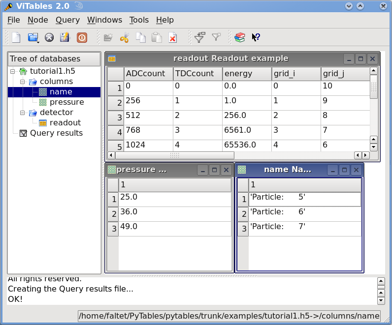

Tutorials
=========
.. epigraph::

    Seràs la clau que obre tots els panys,
    seràs la llum, la llum il.limitada,
    seràs confí on l'aurora comença,
    seràs forment, escala il.luminada!

    -- Lyrics: Vicent Andrés i Estellés. Music: Ovidi Montllor, Toti Soler, M'aclame a tu


This chapter consists of a series of simple yet comprehensive
tutorials that will enable you to understand PyTables' main features. If
you would like more information about some particular instance variable,
global function, or method, look at the doc strings or go to the library
reference in :ref:`library_reference`. If you are reading this in PDF or HTML
formats, follow the corresponding hyperlink near each newly introduced
entity.

Please note that throughout this document the terms *column* and *field*
will be used interchangeably, as will the terms *row* and *record*.

.. currentmodule:: tables

Getting started
---------------
In this section, we will see how to define our own records in Python and save
collections of them (i.e. a *table*) into a file. Then we will select some of
the data in the table using Python cuts and create NumPy arrays to store this
selection as separate objects in a tree.

In *examples/tutorial1-1.py* you will find the working version of all the
code in this section. Nonetheless, this tutorial series has been written to
allow you reproduce it in a Python interactive console. I encourage you to do
parallel testing and inspect the created objects (variables, docs, children
objects, etc.) during the course of the tutorial!


Importing tables objects
~~~~~~~~~~~~~~~~~~~~~~~~
Before starting you need to import the public objects in the tables package.
You normally do that by executing::

    >>> import tables

This is the recommended way to import tables if you don't want to pollute
your namespace. However, PyTables has a contained set of first-level
primitives, so you may consider using the alternative::

    >>> from tables import *

If you are going to work with NumPy arrays (and normally, you will) you will
also need to import functions from the numpy package. So most PyTables
programs begin with::

    >>> import tables   # but in this tutorial we use "from tables import \*"
    >>> import numpy


Declaring a Column Descriptor
~~~~~~~~~~~~~~~~~~~~~~~~~~~~~

Now, imagine that we have a particle detector and we want to create a table
object in order to save data retrieved from it. You need first to define the
table, the number of columns it has, what kind of object is contained in each
column, and so on.

Our particle detector has a TDC (Time to Digital Converter) counter with a
dynamic range of 8 bits and an ADC (Analogical to Digital Converter) with a
range of 16 bits. For these values, we will define 2 fields in our record
object called TDCcount and ADCcount. We also want to save the grid position
in which the particle has been detected, so we will add two new fields called
grid_i and grid_j. Our instrumentation also can obtain the pressure and
energy of the particle. The resolution of the pressure-gauge allows us to use
a single-precision float to store pressure readings, while the energy value
will need a double-precision float. Finally, to track the particle we want to
assign it a name to identify the kind of the particle it is and a unique
numeric identifier. So we will add two more fields: name will be a string of
up to 16 characters, and idnumber will be an integer of 64 bits (to allow us
to store records for extremely large numbers of particles).

Having determined our columns and their types, we can now declare a new
Particle class that will contain all this information::

    >>> from tables import *
    >>> class Particle(IsDescription):
    ...     name      = StringCol(16)   # 16-character String
    ...     idnumber  = Int64Col()      # Signed 64-bit integer
    ...     ADCcount  = UInt16Col()     # Unsigned short integer
    ...     TDCcount  = UInt8Col()      # unsigned byte
    ...     grid_i    = Int32Col()      # 32-bit integer
    ...     grid_j    = Int32Col()      # 32-bit integer
    ...     pressure  = Float32Col()    # float  (single-precision)
    ...     energy    = Float64Col()    # double (double-precision)
    >>>

This definition class is self-explanatory. Basically, you declare a class
variable for each field you need. As its value you assign an instance of the
appropriate Col subclass, according to the kind of column defined (the data
type, the length, the shape, etc). See the :ref:`ColClassDescr` for a
complete description of these subclasses. See also :ref:`datatypes` for a
list of data types supported by the Col constructor.

From now on, we can use Particle instances as a descriptor for our detector
data table. We will see later on how to pass this object to construct the
table. But first, we must create a file where all the actual data pushed into
our table will be saved.


Creating a PyTables file from scratch
~~~~~~~~~~~~~~~~~~~~~~~~~~~~~~~~~~~~~

Use the top-level :func:`open_file` function to create a PyTables file::

    >>> h5file = open_file("tutorial1.h5", mode = "w", title = "Test file")

:func:`open_file` is one of the objects imported by the
```from tables import *``` statement. Here, we are saying that we want to
create a new file in the current working directory called "tutorial1.h5" in
"w"rite mode and with an descriptive title string ("Test file").
This function attempts to open the file, and if successful, returns the File
(see :ref:`FileClassDescr`) object instance h5file. The root of the object
tree is specified in the instance's root attribute.


Creating a new group
~~~~~~~~~~~~~~~~~~~~
Now, to better organize our data, we will create a group called *detector*
that branches from the root node. We will save our particle data table in
this group::

    >>> group = h5file.create_group("/", 'detector', 'Detector information')

Here, we have taken the File instance h5file and invoked its
:meth:`File.create_group` method to create a  new group called *detector*
branching from "*/*" (another way to refer to the h5file.root object we
mentioned above). This will create a new Group (see :ref:`GroupClassDescr`)
object instance that will be assigned to the variable group.


Creating a new table
~~~~~~~~~~~~~~~~~~~~
Let's now create a Table (see :ref:`TableClassDescr`) object as a branch off
the newly-created group. We do that by calling the :meth:`File.create_table`
method of the h5file object::

    >>> table = h5file.create_table(group, 'readout', Particle, "Readout example")

We create the Table instance under group. We assign this table the node name
"*readout*". The Particle class declared before is the *description*
parameter (to define the columns of the table) and finally we set
"*Readout example*" as the Table title. With all this information, a new
Table instance is created and assigned to the variable *table*.

If you are curious about how the object tree looks right now, simply print
the File instance variable *h5file*, and examine the output::

    >>> print(h5file)
    tutorial1.h5 (File) 'Test file'
    Last modif.: 'Wed Mar  7 11:06:12 2007'
    Object Tree:
    / (RootGroup) 'Test file'
    /detector (Group) 'Detector information'
    /detector/readout (Table(0,)) 'Readout example'

As you can see, a dump of the object tree is displayed. It's easy to see the
Group and Table objects we have just created. If you want more information,
just type the variable containing the File instance::

    >>> h5file
    File(filename='tutorial1.h5', title='Test file', mode='w', root_uep='/', filters=Filters(complevel=0, shuffle=False, fletcher32=False))
    / (RootGroup) 'Test file'
    /detector (Group) 'Detector information'
    /detector/readout (Table(0,)) 'Readout example'
    description := {
      "ADCcount": UInt16Col(shape=(), dflt=0, pos=0),
      "TDCcount": UInt8Col(shape=(), dflt=0, pos=1),
      "energy": Float64Col(shape=(), dflt=0.0, pos=2),
      "grid_i": Int32Col(shape=(), dflt=0, pos=3),
      "grid_j": Int32Col(shape=(), dflt=0, pos=4),
      "idnumber": Int64Col(shape=(), dflt=0, pos=5),
      "name": StringCol(itemsize=16, shape=(), dflt='', pos=6),
      "pressure": Float32Col(shape=(), dflt=0.0, pos=7)}
      byteorder := 'little'
      chunkshape := (87,)

More detailed information is displayed about each object in the tree. Note
how Particle, our table descriptor class, is printed as part of the *readout*
table description information. In general, you can obtain much more
information about the objects and their children by just printing them. That
introspection capability is very useful, and I recommend that you use it
extensively.

The time has come to fill this table with some values. First we will get a
pointer to the Row (see :ref:`RowClassDescr`) instance of this table
instance::

    >>> particle = table.row

The row attribute of table points to the Row instance that will be used to
write data rows into the table. We write data simply by assigning the Row
instance the values for each row as if it were a dictionary (although it is
actually an *extension class*), using the column names as keys.

Below is an example of how to write rows::

    >>> for i in xrange(10):
    ...     particle['name']  = 'Particle: %6d' % (i)
    ...     particle['TDCcount'] = i % 256
    ...     particle['ADCcount'] = (i * 256) % (1 << 16)
    ...     particle['grid_i'] = i
    ...     particle['grid_j'] = 10 - i
    ...     particle['pressure'] = float(i*i)
    ...     particle['energy'] = float(particle['pressure'] ** 4)
    ...     particle['idnumber'] = i * (2 ** 34)
    ...     # Insert a new particle record
    ...     particle.append()
    >>>

This code should be easy to understand. The lines inside the loop just assign
values to the different columns in the Row instance particle (see
:ref:`RowClassDescr`). A call to its append() method writes this information
to the table I/O buffer.

After we have processed all our data, we should flush the table's I/O buffer
if we want to write all this data to disk. We achieve that by calling the
table.flush() method::

    >>> table.flush()

Remember, flushing a table is a *very important* step as it will not only
help to maintain the integrity of your file, but also will free valuable
memory resources (i.e. internal buffers) that your program may need for other
things.


.. _readingAndSelectingUsage:

Reading (and selecting) data in a table
~~~~~~~~~~~~~~~~~~~~~~~~~~~~~~~~~~~~~~~
Ok. We have our data on disk, and now we need to access it and select from
specific columns the values we are interested in. See the example below::

    >>> table = h5file.root.detector.readout
    >>> pressure = [x['pressure'] for x in table.iterrows() if x['TDCcount'] > 3 and 20 <= x['pressure'] < 50]
    >>> pressure
    [25.0, 36.0, 49.0]

The first line creates a "shortcut" to the *readout* table deeper on the
object tree. As you can see, we use the *natural naming* schema to access it.
We also could have used the h5file.get_node() method, as we will do later on.

You will recognize the last two lines as a Python list comprehension.
It loops over the rows in *table* as they are provided by the
:meth:`Table.iterrows` iterator. The iterator returns values until all the
data in table is exhausted. These rows are filtered using the expression::

    x['TDCcount'] > 3 and 20 <= x['pressure'] < 50

So, we are selecting the values of the pressure column from filtered records
to create the final list and assign it to pressure variable.

We could have used a normal for loop to accomplish the same purpose, but I
find comprehension syntax to be more compact and elegant.

PyTables do offer other, more powerful ways of performing selections which
may be more suitable if you have very large tables or if you need very high
query speeds. They are called *in-kernel* and *indexed* queries, and you can
use them through :meth:`Table.where` and other related methods.

Let's use an in-kernel selection to query the name column for the same set of
cuts::

    >>> names = [ x['name'] for x in table.where("""(TDCcount > 3) & (20 <= pressure) & (pressure < 50)""") ]
    >>> names
    ['Particle:      5', 'Particle:      6', 'Particle:      7']

In-kernel and indexed queries are not only much faster, but as you can see,
they also look more compact, and are among the greatests features for
PyTables, so be sure that you use them a lot. See :ref:`condition_syntax` and
:ref:`searchOptim` for more information on in-kernel and indexed selections.

.. note::

    A special care should be taken when the query condition includes
    string literals.  Indeed Python 2 string literals are string of
    bytes while Python 3 strings are unicode objects.

    With reference to the above definition of :class:`Particle` it has to be
    noted that the type of the "name" column do not change depending on the
    Python version used (of course).
    It always corresponds to strings of bytes.

    Any condition involving the "name" column should be written using the
    appropriate type for string literals in order to avoid
    :exc:`TypeError`\ s.

    Suppose one wants to get rows corresponding to specific particle names.

    The code below will work fine in Python 2 but will fail with a
    :exc:`TypeError` in Python 3::

        >>> condition = '(name == "Particle:      5") | (name == "Particle:      7")'
        >>> for record in table.where(condition):  # TypeError in Python3
        ...     # do something with "record"

    The reason is that in Python 3 "condition" implies a comparison
    between a string of bytes ("name" column contents) and an unicode
    literals.

    The correct way to write the condition is::

        >>> condition = '(name == b"Particle:      5") | (name == b"Particle:      7")'

That's enough about selections for now. The next section will show you how to
save these selected results to a file.


Creating new array objects
~~~~~~~~~~~~~~~~~~~~~~~~~~
In order to separate the selected data from the mass of detector data, we
will create a new group columns branching off the root group. Afterwards,
under this group, we will create two arrays that will contain the selected
data. First, we create the group::

    >>> gcolumns = h5file.create_group(h5file.root, "columns", "Pressure and Name")

Note that this time we have specified the first parameter using *natural
naming* (h5file.root) instead of with an absolute path string ("/").

Now, create the first of the two Array objects we've just mentioned::

    >>> h5file.create_array(gcolumns, 'pressure', array(pressure), "Pressure column selection")
    /columns/pressure (Array(3,)) 'Pressure column selection'
      atom := Float64Atom(shape=(), dflt=0.0)
      maindim := 0
      flavor := 'numpy'
      byteorder := 'little'
      chunkshape := None

We already know the first two parameters of the :meth:`File.create_array`
methods (these are the same as the first two in create_table): they are the
parent group *where* Array will be created and the Array instance *name*.
The third parameter is the *object* we want to save to disk. In this case, it
is a NumPy array that is built from the selection list we created before.
The fourth parameter is the *title*.

Now, we will save the second array. It contains the list of strings we
selected before: we save this object as-is, with no further conversion::

    >>> h5file.create_array(gcolumns, 'name', names, "Name column selection")
    /columns/name (Array(3,)) 'Name column selection'
      atom := StringAtom(itemsize=16, shape=(), dflt='')
      maindim := 0
      flavor := 'python'
      byteorder := 'irrelevant'
      chunkshape := None

As you can see, :meth:`File.create_array` accepts *names* (which is a regular
Python list) as an *object* parameter. Actually, it accepts a variety of
different regular objects (see :func:`create_array`) as parameters. The flavor
attribute (see the output above) saves the original kind of object that was
saved. Based on this *flavor*, PyTables will be able to retrieve exactly the
same object from disk later on.

Note that in these examples, the create_array method returns an Array instance
that is not assigned to any variable. Don't worry, this is intentional to
show the kind of object we have created by displaying its representation. The
Array objects have been attached to the object tree and saved to disk, as you
can see if you print the complete object tree::

    >>> print(h5file)
    tutorial1.h5 (File) 'Test file'
    Last modif.: 'Wed Mar  7 19:40:44 2007'
    Object Tree:
    / (RootGroup) 'Test file'
    /columns (Group) 'Pressure and Name'
    /columns/name (Array(3,)) 'Name column selection'
    /columns/pressure (Array(3,)) 'Pressure column selection'
    /detector (Group) 'Detector information'
    /detector/readout (Table(10,)) 'Readout example'


Closing the file and looking at its content
~~~~~~~~~~~~~~~~~~~~~~~~~~~~~~~~~~~~~~~~~~~
To finish this first tutorial, we use the close method of the h5file File
object to close the file before exiting Python::

    >>> h5file.close()
    >>> ^D
    $

You have now created your first PyTables file with a table and two arrays.
You can examine it with any generic HDF5 tool, such as h5dump or h5ls. Here is
what the tutorial1.h5 looks like when read with the h5ls program.

.. code-block:: bash

    $ h5ls -rd tutorial1.h5
    /columns                 Group
    /columns/name            Dataset {3}
        Data:
            (0) "Particle:      5", "Particle:      6", "Particle:      7"
    /columns/pressure        Dataset {3}
        Data:
            (0) 25, 36, 49
    /detector                Group
    /detector/readout        Dataset {10/Inf}
        Data:
            (0) {0, 0, 0, 0, 10, 0, "Particle:      0", 0},
            (1) {256, 1, 1, 1, 9, 17179869184, "Particle:      1", 1},
            (2) {512, 2, 256, 2, 8, 34359738368, "Particle:      2", 4},
            (3) {768, 3, 6561, 3, 7, 51539607552, "Particle:      3", 9},
            (4) {1024, 4, 65536, 4, 6, 68719476736, "Particle:      4", 16},
            (5) {1280, 5, 390625, 5, 5, 85899345920, "Particle:      5", 25},
            (6) {1536, 6, 1679616, 6, 4, 103079215104, "Particle:      6", 36},
            (7) {1792, 7, 5764801, 7, 3, 120259084288, "Particle:      7", 49},
            (8) {2048, 8, 16777216, 8, 2, 137438953472, "Particle:      8", 64},
            (9) {2304, 9, 43046721, 9, 1, 154618822656, "Particle:      9", 81}

Here's the output as displayed by the "ptdump" PyTables utility (located in
utils/ directory).

.. code-block:: bash

    $ ptdump tutorial1.h5
    / (RootGroup) 'Test file'
    /columns (Group) 'Pressure and Name'
    /columns/name (Array(3,)) 'Name column selection'
    /columns/pressure (Array(3,)) 'Pressure column selection'
    /detector (Group) 'Detector information'
    /detector/readout (Table(10,)) 'Readout example'

You can pass the :option:`-v` or :option:`-d` options to ptdump if you want
more verbosity. Try them out!

Also, in :ref:`Figure 1 <tutorial1-1-tableview>`, you can admire how the
tutorial1.h5 looks like using the `ViTables <http://vitables.org>`_ graphical
interface.

.. _tutorial1-1-tableview:



    **Figure 1. The initial version of the data file for tutorial 1, with a
    view of the data objects.**


Browsing the *object tree*
--------------------------
In this section, we will learn how to browse the tree and retrieve data and
also meta-information about the actual data.

In *examples/tutorial1-2.py* you will find the working version of all the
code in this section. As before, you are encouraged to use a python shell and
inspect the object tree during the course of the tutorial.


Traversing the object tree
~~~~~~~~~~~~~~~~~~~~~~~~~~
Let's start by opening the file we created in last tutorial section::

    >>> h5file = open_file("tutorial1.h5", "a")

This time, we have opened the file in "a"ppend mode. We use this mode to add
more information to the file.

PyTables, following the Python tradition, offers powerful introspection
capabilities, i.e. you can easily ask information about any component of the
object tree as well as search the tree.

To start with, you can get a preliminary overview of the object tree by
simply printing the existing File instance::

    >>> print(h5file)
    tutorial1.h5 (File) 'Test file'
    Last modif.: 'Wed Mar  7 19:50:57 2007'
    Object Tree:
    / (RootGroup) 'Test file'
    /columns (Group) 'Pressure and Name'
    /columns/name (Array(3,)) 'Name column selection'
    /columns/pressure (Array(3,)) 'Pressure column selection'
    /detector (Group) 'Detector information'
    /detector/readout (Table(10,)) 'Readout example'

It looks like all of our objects are there. Now let's make use of the File
iterator to see how to list all the nodes in the object tree::

    >>> for node in h5file:
    ...     print(node)
    / (RootGroup) 'Test file'
    /columns (Group) 'Pressure and Name'
    /detector (Group) 'Detector information'
    /columns/name (Array(3,)) 'Name column selection'
    /columns/pressure (Array(3,)) 'Pressure column selection'
    /detector/readout (Table(10,)) 'Readout example'

We can use the :meth:`File.walk_groups` method of the File class to list only
the *groups* on tree::

    >>> for group in h5file.walk_groups():
    ...     print(group)
    / (RootGroup) 'Test file'
    /columns (Group) 'Pressure and Name'
    /detector (Group) 'Detector information'

Note that :meth:`File.walk_groups` actually returns an *iterator*, not a list
of objects. Using this iterator with the list_nodes() method is a powerful
combination. Let's see an example listing of all the arrays in the tree::

    >>> for group in h5file.walk_groups("/"):
    ...     for array in h5file.list_nodes(group, classname='Array'):
    ...         print(array)
    /columns/name (Array(3,)) 'Name column selection'
    /columns/pressure (Array(3,)) 'Pressure column selection'

:meth:`File.list_nodes` returns a list containing all the nodes hanging off a
specific Group. If the *classname* keyword is specified, the method will
filter out all instances which are not descendants of the class. We have
asked for only Array instances. There exist also an iterator counterpart
called :meth:`File.iter_nodes` that might be handy is some situations, like
for example when dealing with groups with a large number of nodes behind it.

We can combine both calls by using the :meth:`File.walk_nodes` special method
of the File object. For example::

    >>> for array in h5file.walk_nodes("/", "Array"):
    ...     print(array)
    /columns/name (Array(3,)) 'Name column selection'
    /columns/pressure (Array(3,)) 'Pressure column selection'

This is a nice shortcut when working interactively.

Finally, we will list all the Leaf, i.e. Table and Array instances (see
:ref:`LeafClassDescr` for detailed information on Leaf class), in the
/detector group. Note that only one instance of the Table class (i.e.
readout) will be selected in this group (as should be the case)::

    >>> for leaf in h5file.root.detector._f_walknodes('Leaf'):
    ...     print(leaf)
    /detector/readout (Table(10,)) 'Readout example'

We have used a call to the :meth:`Group._f_walknodes` method, using the
*natural naming* path specification.

Of course you can do more sophisticated node selections using these powerful
methods. But first, let's take a look at some important PyTables object
instance variables.


Setting and getting user attributes
~~~~~~~~~~~~~~~~~~~~~~~~~~~~~~~~~~~
PyTables provides an easy and concise way to complement the meaning of your
node objects on the tree by using the AttributeSet class (see
:ref:`AttributeSetClassDescr`). You can access this object through the
standard attribute attrs in Leaf nodes and _v_attrs in Group nodes.

For example, let's imagine that we want to save the date indicating when the
data in /detector/readout table has been acquired, as well as the temperature
during the gathering process::

    >>> table = h5file.root.detector.readout
    >>> table.attrs.gath_date = "Wed, 06/12/2003 18:33"
    >>> table.attrs.temperature = 18.4
    >>> table.attrs.temp_scale = "Celsius"

Now, let's set a somewhat more complex attribute in the /detector group::

    >>> detector = h5file.root.detector
    >>> detector._v_attrs.stuff = [5, (2.3, 4.5), "Integer and tuple"]

Note how the AttributeSet instance is accessed with the _v_attrs attribute
because detector is a Group node. In general, you can save any standard
Python data structure as an attribute node. See :ref:`AttributeSetClassDescr`
for a more detailed explanation of how they are serialized for export to
disk.

Retrieving the attributes is equally simple::

    >>> table.attrs.gath_date
    'Wed, 06/12/2003 18:33'
    >>> table.attrs.temperature
    18.399999999999999
    >>> table.attrs.temp_scale
    'Celsius'
    >>> detector._v_attrs.stuff
    [5, (2.2999999999999998, 4.5), 'Integer and tuple']

You can probably guess how to delete attributes::

    >>> del table.attrs.gath_date

If you want to examine the current user attribute set of /detector/table, you
can print its representation (try hitting the TAB key twice if you are on a
Unix Python console with the rlcompleter module active)::

    >>> table.attrs
    /detector/readout._v_attrs (AttributeSet), 23 attributes:
        [CLASS := 'TABLE',
         FIELD_0_FILL := 0,
         FIELD_0_NAME := 'ADCcount',
         FIELD_1_FILL := 0,
         FIELD_1_NAME := 'TDCcount',
         FIELD_2_FILL := 0.0,
         FIELD_2_NAME := 'energy',
         FIELD_3_FILL := 0,
         FIELD_3_NAME := 'grid_i',
         FIELD_4_FILL := 0,
         FIELD_4_NAME := 'grid_j',
         FIELD_5_FILL := 0,
         FIELD_5_NAME := 'idnumber',
         FIELD_6_FILL := '',
         FIELD_6_NAME := 'name',
         FIELD_7_FILL := 0.0,
         FIELD_7_NAME := 'pressure',
         FLAVOR := 'numpy',
         NROWS := 10,
         TITLE := 'Readout example',
         VERSION := '2.6',
         temp_scale := 'Celsius',
         temperature := 18.399999999999999]

We've got all the attributes (including the *system* attributes). You can get
a list of *all* attributes or only the *user* or *system* attributes with the
_f_list() method::

    >>> print(table.attrs._f_list("all"))
    ['CLASS', 'FIELD_0_FILL', 'FIELD_0_NAME', 'FIELD_1_FILL', 'FIELD_1_NAME',
    'FIELD_2_FILL', 'FIELD_2_NAME', 'FIELD_3_FILL', 'FIELD_3_NAME', 'FIELD_4_FILL',
    'FIELD_4_NAME', 'FIELD_5_FILL', 'FIELD_5_NAME', 'FIELD_6_FILL', 'FIELD_6_NAME',
    'FIELD_7_FILL', 'FIELD_7_NAME', 'FLAVOR', 'NROWS', 'TITLE', 'VERSION',
    'temp_scale', 'temperature']
    >>> print(table.attrs._f_list("user"))
    ['temp_scale', 'temperature']
    >>> print(table.attrs._f_list("sys"))
    ['CLASS', 'FIELD_0_FILL', 'FIELD_0_NAME', 'FIELD_1_FILL', 'FIELD_1_NAME',
    'FIELD_2_FILL', 'FIELD_2_NAME', 'FIELD_3_FILL', 'FIELD_3_NAME', 'FIELD_4_FILL',
    'FIELD_4_NAME', 'FIELD_5_FILL', 'FIELD_5_NAME', 'FIELD_6_FILL', 'FIELD_6_NAME',
    'FIELD_7_FILL', 'FIELD_7_NAME', 'FLAVOR', 'NROWS', 'TITLE', 'VERSION']

You can also rename attributes::

    >>> table.attrs._f_rename("temp_scale","tempScale")
    >>> print(table.attrs._f_list())
    ['tempScale', 'temperature']

And, from PyTables 2.0 on, you are allowed also to set, delete or rename
system attributes::

    >>> table.attrs._f_rename("VERSION", "version")
    >>> table.attrs.VERSION
    Traceback (most recent call last):
        File "<stdin>", line 1, in <module>
        File "tables/attributeset.py", line 222, in __getattr__
            (name, self._v__nodepath)
    AttributeError: Attribute 'VERSION' does not exist in node: '/detector/readout'
    >>> table.attrs.version
    '2.6'

*Caveat emptor:* you must be careful when modifying system attributes because
you may end fooling PyTables and ultimately getting unwanted behaviour. Use
this only if you know what are you doing.

So, given the caveat above, we will proceed to restore the original name of
VERSION attribute::

    >>> table.attrs._f_rename("version", "VERSION")
    >>> table.attrs.VERSION
    '2.6'

Ok. that's better. If you would terminate your session now, you would be able
to use the h5ls command to read the /detector/readout attributes from the
file written to disk.

.. code-block:: bash

    $ h5ls -vr tutorial1.h5/detector/readout
    Opened "tutorial1.h5" with sec2 driver.
    /detector/readout        Dataset {10/Inf}
        Attribute: CLASS     scalar
            Type:      6-byte null-terminated ASCII string
            Data:  "TABLE"
        Attribute: VERSION   scalar
            Type:      4-byte null-terminated ASCII string
            Data:  "2.6"
        Attribute: TITLE     scalar
            Type:      16-byte null-terminated ASCII string
            Data:  "Readout example"
        Attribute: NROWS     scalar
            Type:      native long long
            Data:  10
        Attribute: FIELD_0_NAME scalar
            Type:      9-byte null-terminated ASCII string
            Data:  "ADCcount"
        Attribute: FIELD_1_NAME scalar
            Type:      9-byte null-terminated ASCII string
            Data:  "TDCcount"
        Attribute: FIELD_2_NAME scalar
            Type:      7-byte null-terminated ASCII string
            Data:  "energy"
        Attribute: FIELD_3_NAME scalar
            Type:      7-byte null-terminated ASCII string
            Data:  "grid_i"
        Attribute: FIELD_4_NAME scalar
            Type:      7-byte null-terminated ASCII string
            Data:  "grid_j"
        Attribute: FIELD_5_NAME scalar
            Type:      9-byte null-terminated ASCII string
            Data:  "idnumber"
        Attribute: FIELD_6_NAME scalar
            Type:      5-byte null-terminated ASCII string
            Data:  "name"
        Attribute: FIELD_7_NAME scalar
            Type:      9-byte null-terminated ASCII string
            Data:  "pressure"
        Attribute: FLAVOR    scalar
            Type:      5-byte null-terminated ASCII string
            Data:  "numpy"
        Attribute: tempScale scalar
            Type:      7-byte null-terminated ASCII string
            Data:  "Celsius"
        Attribute: temperature scalar
            Type:      native double
            Data:  18.4
        Location:  0:1:0:1952
        Links:     1
        Modified:  2006-12-11 10:35:13 CET
        Chunks:    {85} 3995 bytes
        Storage:   470 logical bytes, 3995 allocated bytes, 11.76% utilization
        Type:      struct {
                        "ADCcount"         +0    native unsigned short
                        "TDCcount"         +2    native unsigned char
                        "energy"           +3    native double
                        "grid_i"           +11   native int
                        "grid_j"           +15   native int
                        "idnumber"         +19   native long long
                        "name"             +27   16-byte null-terminated ASCII string
                        "pressure"         +43   native float
                    } 47 bytes

Attributes are a useful mechanism to add persistent (meta) information to
your data.


Getting object metadata
~~~~~~~~~~~~~~~~~~~~~~~
Each object in PyTables has *metadata* information about the data in the
file. Normally this *meta-information* is accessible through the node
instance variables. Let's take a look at some examples::

    >>> print("Object:", table)
    Object: /detector/readout (Table(10,)) 'Readout example'
    >>> print("Table name:", table.name)
    Table name: readout
    >>> print("Table title:", table.title)
    Table title: Readout example
    >>> print("Number of rows in table:", table.nrows)
    Number of rows in table: 10
    >>> print("Table variable names with their type and shape:")
    Table variable names with their type and shape:
    >>> for name in table.colnames:
    ...     print(name, ':= %s, %s' % (table.coldtypes[name], table.coldtypes[name].shape))
    ADCcount := uint16, ()
    TDCcount := uint8, ()
    energy := float64, ()
    grid_i := int32, ()
    grid_j := int32, ()
    idnumber := int64, ()
    name := |S16, ()
    pressure := float32, ()

Here, the name, title, nrows, colnames and coldtypes attributes (see
:class:`Table` for a complete attribute list) of the Table object gives us
quite a bit of information about the table data.

You can interactively retrieve general information about the public objects
in PyTables by asking for help::

    >>> help(table)
    Help on Table in module tables.table:
    class Table(tableextension.Table, tables.leaf.Leaf)
    |  This class represents heterogeneous datasets in an HDF5 file.
    |
    |  Tables are leaves (see the `Leaf` class) whose data consists of a
    |  unidimensional sequence of *rows*, where each row contains one or
    |  more *fields*.  Fields have an associated unique *name* and
    |  *position*, with the first field having position 0.  All rows have
    |  the same fields, which are arranged in *columns*.
    [snip]
    |
    |  Instance variables
    |  ------------------
    |
    |  The following instance variables are provided in addition to those
    |  in `Leaf`.  Please note that there are several `col` dictionaries
    |  to ease retrieving information about a column directly by its path
    |  name, avoiding the need to walk through `Table.description` or
    |  `Table.cols`.
    |
    |  autoindex
    |      Automatically keep column indexes up to date?
    |
    |      Setting this value states whether existing indexes should be
    |      automatically updated after an append operation or recomputed
    |      after an index-invalidating operation (i.e. removal and
    |      modification of rows).  The default is true.
    [snip]
    |  rowsize
    |      The size in bytes of each row in the table.
    |
    |  Public methods -- reading
    |  -------------------------
    |
    |  * col(name)
    |  * iterrows([start][, stop][, step])
    |  * itersequence(sequence)
    * itersorted(sortby[, checkCSI][, start][, stop][, step])
    |  * read([start][, stop][, step][, field][, coords])
    |  * read_coordinates(coords[, field])
    * read_sorted(sortby[, checkCSI][, field,][, start][, stop][, step])
    |  * __getitem__(key)
    |  * __iter__()
    |
    |  Public methods -- writing
    |  -------------------------
    |
    |  * append(rows)
    |  * modify_column([start][, stop][, step][, column][, colname])
    [snip]

Try getting help with other object docs by yourself::

    >>> help(h5file)
    >>> help(table.remove_rows)

To examine metadata in the */columns/pressure* Array object::

    >>> pressureObject = h5file.get_node("/columns", "pressure")
    >>> print("Info on the object:", repr(pressureObject))
    Info on the object: /columns/pressure (Array(3,)) 'Pressure column selection'
      atom := Float64Atom(shape=(), dflt=0.0)
      maindim := 0
      flavor := 'numpy'
      byteorder := 'little'
      chunkshape := None
    >>> print("  shape: ==>", pressureObject.shape)
      shape: ==> (3,)
    >>> print("  title: ==>", pressureObject.title)
      title: ==> Pressure column selection
    >>> print("  atom: ==>", pressureObject.atom)
      atom: ==> Float64Atom(shape=(), dflt=0.0)

Observe that we have used the :meth:`File.get_node` method of the File class
to access a node in the tree, instead of the natural naming method. Both are
useful, and depending on the context you will prefer one or the other.
:meth:`File.get_node` has the advantage that it can get a node from the
pathname string (as in this example) and can also act as a filter to show
only nodes in a particular location that are instances of class *classname*.
In general, however, I consider natural naming to be more elegant and easier
to use, especially if you are using the name completion capability present in
interactive console. Try this powerful combination of natural naming and
completion capabilities present in most Python consoles, and see how pleasant
it is to browse the object tree (well, as pleasant as such an activity can
be).

If you look at the type attribute of the pressureObject object, you can
verify that it is a "*float64*" array. By looking at its shape attribute, you
can deduce that the array on disk is unidimensional and has 3 elements.
See :class:`Array` or the internal doc strings for the complete Array
attribute list.


Reading data from Array objects
~~~~~~~~~~~~~~~~~~~~~~~~~~~~~~~
Once you have found the desired Array, use the read() method of the Array
object to retrieve its data::

    >>> pressureArray = pressureObject.read()
    >>> pressureArray
    array([ 25.,  36.,  49.])
    >>> print("pressureArray is an object of type:", type(pressureArray))
    pressureArray is an object of type: <type 'numpy.ndarray'>
    >>> nameArray = h5file.root.columns.name.read()
    >>> print("nameArray is an object of type:", type(nameArray))
    nameArray is an object of type: <type 'list'>
    >>>
    >>> print("Data on arrays nameArray and pressureArray:")
    Data on arrays nameArray and pressureArray:
    >>> for i in range(pressureObject.shape[0]):
    ...     print(nameArray[i], "-->", pressureArray[i])
    Particle:      5 --> 25.0
    Particle:      6 --> 36.0
    Particle:      7 --> 49.0

You can see that the :meth:`Array.read` method returns an authentic NumPy
object for the pressureObject instance by looking at the output of the type()
call. A read() of the nameArray object instance returns a native Python list
(of strings). The type of the object saved is stored as an HDF5 attribute
(named FLAVOR) for objects on disk. This attribute is then read as Array
meta-information (accessible through in the Array.attrs.FLAVOR variable),
enabling the read array to be converted into the original object. This
provides a means to save a large variety of objects as arrays with the
guarantee that you will be able to later recover them in their original form.
See :meth:`File.create_array` for a complete list of supported objects for the
Array object class.


Commiting data to tables and arrays
-----------------------------------
We have seen how to create tables and arrays and how to browse both data and
metadata in the object tree. Let's examine more closely now one of the most
powerful capabilities of PyTables, namely, how to modify already created
tables and arrays [1]_


Appending data to an existing table
~~~~~~~~~~~~~~~~~~~~~~~~~~~~~~~~~~~
Now, let's have a look at how we can add records to an existing table on
disk. Let's use our well-known *readout* Table object and append some new
values to it::

    >>> table = h5file.root.detector.readout
    >>> particle = table.row
    >>> for i in xrange(10, 15):
    ...     particle['name']  = 'Particle: %6d' % (i)
    ...     particle['TDCcount'] = i % 256
    ...     particle['ADCcount'] = (i * 256) % (1 << 16)
    ...     particle['grid_i'] = i
    ...     particle['grid_j'] = 10 - i
    ...     particle['pressure'] = float(i*i)
    ...     particle['energy'] = float(particle['pressure'] ** 4)
    ...     particle['idnumber'] = i * (2 ** 34)
    ...     particle.append()
    >>> table.flush()

It's the same method we used to fill a new table. PyTables knows that this
table is on disk, and when you add new records, they are appended to the end
of the table [2]_.

If you look carefully at the code you will see that we have used the
table.row attribute to create a table row and fill it with the new values.
Each time that its append() method is called, the actual row is committed to
the output buffer and the row pointer is incremented to point to the next
table record. When the buffer is full, the data is saved on disk, and the
buffer is reused again for the next cycle.

*Caveat emptor*: Do not forget to always call the flush() method after a
write operation, or else your tables will not be updated!

Let's have a look at some rows in the modified table and verify that our new
data has been appended::

    >>> for r in table.iterrows():
    ...     print("%-16s | %11.1f | %11.4g | %6d | %6d | %8d \|" % \\
    ...         (r['name'], r['pressure'], r['energy'], r['grid_i'], r['grid_j'],
    ...         r['TDCcount']))
    Particle:      0 |         0.0 |           0 |      0 |     10 |        0 |
    Particle:      1 |         1.0 |           1 |      1 |      9 |        1 |
    Particle:      2 |         4.0 |         256 |      2 |      8 |        2 |
    Particle:      3 |         9.0 |        6561 |      3 |      7 |        3 |
    Particle:      4 |        16.0 |   6.554e+04 |      4 |      6 |        4 |
    Particle:      5 |        25.0 |   3.906e+05 |      5 |      5 |        5 |
    Particle:      6 |        36.0 |    1.68e+06 |      6 |      4 |        6 |
    Particle:      7 |        49.0 |   5.765e+06 |      7 |      3 |        7 |
    Particle:      8 |        64.0 |   1.678e+07 |      8 |      2 |        8 |
    Particle:      9 |        81.0 |   4.305e+07 |      9 |      1 |        9 |
    Particle:     10 |       100.0 |       1e+08 |     10 |      0 |       10 |
    Particle:     11 |       121.0 |   2.144e+08 |     11 |     -1 |       11 |
    Particle:     12 |       144.0 |     4.3e+08 |     12 |     -2 |       12 |
    Particle:     13 |       169.0 |   8.157e+08 |     13 |     -3 |       13 |
    Particle:     14 |       196.0 |   1.476e+09 |     14 |     -4 |       14 |


Modifying data in tables
~~~~~~~~~~~~~~~~~~~~~~~~
Ok, until now, we've been only reading and writing (appending) values to our
tables. But there are times that you need to modify your data once you have
saved it on disk (this is specially true when you need to modify the real
world data to adapt your goals ;).
Let's see how we can modify the values that were saved in our existing tables.
We will start modifying single cells in the first row of the Particle table::

    >>> print("Before modif-->", table[0])
    Before modif--> (0, 0, 0.0, 0, 10, 0L, 'Particle:      0', 0.0)
    >>> table.cols.TDCcount[0] = 1
    >>> print("After modifying first row of ADCcount-->", table[0])
    After modifying first row of ADCcount--> (0, 1, 0.0, 0, 10, 0L, 'Particle:      0', 0.0)
    >>> table.cols.energy[0] = 2
    >>> print("After modifying first row of energy-->", table[0])
    After modifying first row of energy--> (0, 1, 2.0, 0, 10, 0L, 'Particle:      0', 0.0)

We can modify complete ranges of columns as well::

    >>> table.cols.TDCcount[2:5] = [2,3,4]
    >>> print("After modifying slice [2:5] of TDCcount-->", table[0:5])
    After modifying slice [2:5] of TDCcount-->
    [(0, 1, 2.0, 0, 10, 0L, 'Particle:      0', 0.0)
     (256, 1, 1.0, 1, 9, 17179869184L, 'Particle:      1', 1.0)
     (512, 2, 256.0, 2, 8, 34359738368L, 'Particle:      2', 4.0)
     (768, 3, 6561.0, 3, 7, 51539607552L, 'Particle:      3', 9.0)
     (1024, 4, 65536.0, 4, 6, 68719476736L, 'Particle:      4', 16.0)]
    >>> table.cols.energy[1:9:3] = [2,3,4]
    >>> print("After modifying slice [1:9:3] of energy-->", table[0:9])
    After modifying slice [1:9:3] of energy-->
    [(0, 1, 2.0, 0, 10, 0L, 'Particle:      0', 0.0)
     (256, 1, 2.0, 1, 9, 17179869184L, 'Particle:      1', 1.0)
     (512, 2, 256.0, 2, 8, 34359738368L, 'Particle:      2', 4.0)
     (768, 3, 6561.0, 3, 7, 51539607552L, 'Particle:      3', 9.0)
     (1024, 4, 3.0, 4, 6, 68719476736L, 'Particle:      4', 16.0)
     (1280, 5, 390625.0, 5, 5, 85899345920L, 'Particle:      5', 25.0)
     (1536, 6, 1679616.0, 6, 4, 103079215104L, 'Particle:      6', 36.0)
     (1792, 7, 4.0, 7, 3, 120259084288L, 'Particle:      7', 49.0)
     (2048, 8, 16777216.0, 8, 2, 137438953472L, 'Particle:      8', 64.0)]

Check that the values have been correctly modified!

.. hint::

    remember that column TDCcount is the second one, and that energy is the
    third. Look for more info on modifying columns in
    :meth:`Column.__setitem__`.

PyTables also lets you modify complete sets of rows at the same time. As a
demonstration of these capability, see the next example::

    >>> table.modify_rows(start=1, step=3,
    ...                 rows=[(1, 2, 3.0, 4, 5, 6L, 'Particle:   None', 8.0),
    ...                       (2, 4, 6.0, 8, 10, 12L, 'Particle: None*2', 16.0)])
    2
    >>> print("After modifying the complete third row-->", table[0:5])
    After modifying the complete third row-->
    [(0, 1, 2.0, 0, 10, 0L, 'Particle:      0', 0.0)
     (1, 2, 3.0, 4, 5, 6L, 'Particle:   None', 8.0)
     (512, 2, 256.0, 2, 8, 34359738368L, 'Particle:      2', 4.0)
     (768, 3, 6561.0, 3, 7, 51539607552L, 'Particle:      3', 9.0)
     (2, 4, 6.0, 8, 10, 12L, 'Particle: None*2', 16.0)]

As you can see, the modify_rows() call has modified the rows second and fifth,
and it returned the number of modified rows.

Apart of :meth:`Table.modify_rows`, there exists another method, called
:meth:`Table.modify_column` to modify specific columns as well.

Finally, it exists another way of modifying tables that is generally more
handy than the described above. This new way uses the method
:meth:`Row.update` of the Row instance that is attached to every table, so it
is meant to be used in table iterators. Look at the next example::

    >>> for row in table.where('TDCcount <= 2'):
    ...     row['energy'] = row['TDCcount']*2
    ...     row.update()
    >>> print("After modifying energy column (where TDCcount <=2)-->", table[0:4])
    After modifying energy column (where TDCcount <=2)-->
    [(0, 1, 2.0, 0, 10, 0L, 'Particle:      0', 0.0)
     (1, 2, 4.0, 4, 5, 6L, 'Particle:   None', 8.0)
     (512, 2, 4.0, 2, 8, 34359738368L, 'Particle:      2', 4.0)
     (768, 3, 6561.0, 3, 7, 51539607552L, 'Particle:      3', 9.0)]

.. note::

    The authors find this way of updating tables (i.e. using Row.update())
    to be both convenient and efficient. Please make sure to use it
    extensively.


Modifying data in arrays
~~~~~~~~~~~~~~~~~~~~~~~~

We are going now to see how to modify data in array objects.
The basic way to do this is through the use of :meth:`Array.__setitem__`
special method. Let's see at how modify data on the pressureObject array::

    >>> pressureObject = h5file.root.columns.pressure
    >>> print("Before modif-->", pressureObject[:])
    Before modif--> [ 25.  36.  49.]
    >>> pressureObject[0] = 2
    >>> print("First modif-->", pressureObject[:])
    First modif--> [  2.  36.  49.]
    >>> pressureObject[1:3] = [2.1, 3.5]
    >>> print("Second modif-->", pressureObject[:])
    Second modif--> [ 2.   2.1  3.5]
    >>> pressureObject[::2] = [1,2]
    >>> print("Third modif-->", pressureObject[:])
    Third modif--> [ 1.   2.1  2. ]

So, in general, you can use any combination of (multidimensional) extended
slicing.

With the sole exception that you cannot use negative values for step to refer
to indexes that you want to modify. See :meth:`Array.__getitem__` for more
examples on how to use extended slicing in PyTables objects.

Similarly, with an array of strings::

    >>> nameObject = h5file.root.columns.name
    >>> print("Before modif-->", nameObject[:])
    Before modif--> ['Particle:      5', 'Particle:      6', 'Particle:      7']
    >>> nameObject[0] = 'Particle:   None'
    >>> print("First modif-->", nameObject[:])
    First modif--> ['Particle:   None', 'Particle:      6', 'Particle:      7']
    >>> nameObject[1:3] = ['Particle:      0', 'Particle:      1']
    >>> print("Second modif-->", nameObject[:])
    Second modif--> ['Particle:   None', 'Particle:      0', 'Particle:      1']
    >>> nameObject[::2] = ['Particle:     -3', 'Particle:     -5']
    >>> print("Third modif-->", nameObject[:])
    Third modif--> ['Particle:     -3', 'Particle:      0', 'Particle:     -5']


And finally... how to delete rows from a table
~~~~~~~~~~~~~~~~~~~~~~~~~~~~~~~~~~~~~~~~~~~~~~
We'll finish this tutorial by deleting some rows from the table we have.
Suppose that we want to delete the 5th to 9th rows (inclusive)::

    >>> table.remove_rows(5,10)
    5

:meth:`Table.remove_rows` deletes the rows in the range (start, stop). It
returns the number of rows effectively removed.

We have reached the end of this first tutorial. Don't forget to close the
file when you finish::

    >>> h5file.close()
    >>> ^D
    $

In :ref:`Figure 2 <tutorial1-2-tableview>` you can see a graphical view of the
PyTables file with the datasets we have just created. In
:ref:`tutorial1-general` are displayed the general properties of the table
/detector/readout.

.. _tutorial1-2-tableview:


    **Figure 2. The final version of the data file for tutorial 1.**


.. _tutorial1-general:


    **Figure 3. General properties of the /detector/readout table.**


.. _secondExample:

Multidimensional table cells and automatic sanity checks
--------------------------------------------------------
Now it's time for a more real-life example (i.e. with errors in the code). We
will create two groups that branch directly from the root node, Particles and
Events. Then, we will put three tables in each group. In Particles we will
put tables based on the Particle descriptor and in Events, the tables based
the Event descriptor.

Afterwards, we will provision the tables with a number of records. Finally,
we will read the newly-created table /Events/TEvent3 and select some values
from it, using a comprehension list.

Look at the next script (you can find it in :file:`examples/tutorial2.py`).
It appears to do all of the above, but it contains some small bugs. Note that
this Particle class is not directly related to the one defined in
last tutorial; this class is simpler (note, however, the *multidimensional*
columns called pressure and temperature).

We also introduce a new manner to describe a Table as a structured NumPy
dtype (or even as a dictionary), as you can see in the Event description. See
:meth:`File.create_table` about the different kinds of descriptor objects that
can be passed to this method::

    from tables import *
    from numpy import *

    # Describe a particle record
    class Particle(IsDescription):
        name        = StringCol(itemsize=16)  # 16-character string
        lati        = Int32Col()              # integer
        longi       = Int32Col()              # integer
        pressure    = Float32Col(shape=(2,3)) # array of floats (single-precision)
        temperature = Float64Col(shape=(2,3)) # array of doubles (double-precision)

    # Native NumPy dtype instances are also accepted
    Event = dtype([
        ("name"     , "S16"),
        ("TDCcount" , uint8),
        ("ADCcount" , uint16),
        ("xcoord"   , float32),
        ("ycoord"   , float32)
        ])

    # And dictionaries too (this defines the same structure as above)
    # Event = {
    #     "name"     : StringCol(itemsize=16),
    #     "TDCcount" : UInt8Col(),
    #     "ADCcount" : UInt16Col(),
    #     "xcoord"   : Float32Col(),
    #     "ycoord"   : Float32Col(),
    #     }

    # Open a file in "w"rite mode
    fileh = open_file("tutorial2.h5", mode = "w")

    # Get the HDF5 root group
    root = fileh.root

    # Create the groups:
    for groupname in ("Particles", "Events"):
        group = fileh.create_group(root, groupname)

    # Now, create and fill the tables in Particles group
    gparticles = root.Particles

    # Create 3 new tables
    for tablename in ("TParticle1", "TParticle2", "TParticle3"):
        # Create a table
        table = fileh.create_table("/Particles", tablename, Particle, "Particles: "+tablename)

        # Get the record object associated with the table:
        particle = table.row

        # Fill the table with 257 particles
        for i in xrange(257):
            # First, assign the values to the Particle record
            particle['name'] = 'Particle: %6d' % (i)
            particle['lati'] = i
            particle['longi'] = 10 - i

            ########### Detectable errors start here. Play with them!
            particle['pressure'] = array(i*arange(2*3)).reshape((2,4))  # Incorrect
            #particle['pressure'] = array(i*arange(2*3)).reshape((2,3)) # Correct
            ########### End of errors

            particle['temperature'] = (i**2)     # Broadcasting

            # This injects the Record values
            particle.append()

        # Flush the table buffers
        table.flush()

    # Now, go for Events:
    for tablename in ("TEvent1", "TEvent2", "TEvent3"):
        # Create a table in Events group
        table = fileh.create_table(root.Events, tablename, Event, "Events: "+tablename)

        # Get the record object associated with the table:
        event = table.row

        # Fill the table with 257 events
        for i in xrange(257):
            # First, assign the values to the Event record
            event['name']  = 'Event: %6d' % (i)
            event['TDCcount'] = i % (1<<8)   # Correct range

            ########### Detectable errors start here. Play with them!
            event['xcoor'] = float(i**2)     # Wrong spelling
            #event['xcoord'] = float(i**2)   # Correct spelling
            event['ADCcount'] = "sss"        # Wrong type
            #event['ADCcount'] = i * 2       # Correct type
            ########### End of errors

            event['ycoord'] = float(i)**4

            # This injects the Record values
            event.append()

        # Flush the buffers
        table.flush()

    # Read the records from table "/Events/TEvent3" and select some
    table = root.Events.TEvent3
    e = [ p['TDCcount'] for p in table if p['ADCcount'] < 20 and 4 <= p['TDCcount'] < 15 ]
    print("Last record ==>", p)
    print("Selected values ==>", e)
    print("Total selected records ==> ", len(e))

    # Finally, close the file (this also will flush all the remaining buffers!)
    fileh.close()


Shape checking
~~~~~~~~~~~~~~
If you look at the code carefully, you'll see that it won't work. You will
get the following error.

.. code-block:: bash

    $ python tutorial2.py
    Traceback (most recent call last):
      File "tutorial2.py", line 60, in <module>
        particle['pressure'] = array(i*arange(2*3)).reshape((2,4))  # Incorrect
    ValueError: total size of new array must be unchanged
    Closing remaining open files: tutorial2.h5... done

This error indicates that you are trying to assign an array with an
incompatible shape to a table cell. Looking at the source, we see that we
were trying to assign an array of shape (2,4) to a pressure element, which
was defined with the shape (2,3).

In general, these kinds of operations are forbidden, with one valid
exception: when you assign a *scalar* value to a multidimensional column
cell, all the cell elements are populated with the value of the scalar.
For example::

    particle['temperature'] = (i**2)    # Broadcasting

The value i**2 is assigned to all the elements of the temperature table cell.
This capability is provided by the NumPy package and is known as
*broadcasting*.


Field name checking
~~~~~~~~~~~~~~~~~~~
After fixing the previous error and rerunning the program, we encounter
another error.

.. code-block:: bash

    $ python tutorial2.py
    Traceback (most recent call last):
      File "tutorial2.py", line 73, in ?
        event['xcoor'] = float(i**2)     # Wrong spelling
      File "tableextension.pyx", line 1094, in tableextension.Row.__setitem__
      File "tableextension.pyx", line 127, in tableextension.get_nested_field_cache
      File "utilsextension.pyx", line 331, in utilsextension.get_nested_field
    KeyError: 'no such column: xcoor'

This error indicates that we are attempting to assign a value to a
non-existent field in the *event* table object. By looking carefully at the
Event class attributes, we see that we misspelled the xcoord field (we wrote
xcoor instead). This is unusual behavior for Python, as normally when you
assign a value to a non-existent instance variable, Python creates a new
variable with that name. Such a feature can be dangerous when dealing with an
object that contains a fixed list of field names. PyTables checks that the
field exists and raises a KeyError if the check fails.


Data type checking
~~~~~~~~~~~~~~~~~~
Finally, the last issue which we will find here is a TypeError exception.

.. code-block:: bash

    $ python tutorial2.py
    Traceback (most recent call last):
      File "tutorial2.py", line 75, in ?
        event['ADCcount'] = "sss"          # Wrong type
      File "tableextension.pyx", line 1111, in tableextension.Row.__setitem__
    TypeError: invalid type (<type 'str'>) for column ``ADCcount``

And, if we change the affected line to read::

    event.ADCcount = i * 2        # Correct type

we will see that the script ends well.

You can see the structure created with this (corrected) script in
:ref:`Figure 4 <tutorial2-tableview>`.
In particular, note the multidimensional column cells in table
/Particles/TParticle2.

.. _tutorial2-tableview:


    **Figure 4. Table hierarchy for tutorial 2.**


.. _LinksTutorial:

Using links for more convenient access to nodes
-----------------------------------------------
Links are special nodes that can be used to create additional paths to your
existing nodes.  PyTables supports three kinds of links: hard links, soft
links (aka symbolic links) and external links.

Hard links let the user create additional paths to access another node in the
same file, and once created, they are indistinguishable from the referred
node object, except that they have different paths in the object tree.  For
example, if the referred node is, say, a Table object, then the new hard link
will become a Table object itself.  From this point on, you will be able to
access the same Table object from two different paths: the original one and
the new hard link path.  If you delete one path to the table, you will be
able to reach it via the other path.

Soft links are similar to hard links, but they keep their own personality.
When you create a soft link to another node, you will get a new SoftLink
object that *refers* to that node.  However, in order to access the referred
node, you need to *dereference* it.

Finally, external links are like soft links, with the difference that these
are meant to point to nodes in *external* files instead of nodes in the same
file.  They are represented by the ExternalLink class and, like soft links,
you need to dereference them in order to get access to the pointed node.


Interactive example
~~~~~~~~~~~~~~~~~~~
Now we are going to learn how to deal with links. You can find the code used
in this section in :file:`examples/links.py`.

First, let's create a file with some group structure::

    >>> import tables as tb
    >>> f1 = tb.open_file('links1.h5', 'w')
    >>> g1 = f1.create_group('/', 'g1')
    >>> g2 = f1.create_group(g1, 'g2')

Now, we will put some datasets on the /g1 and /g1/g2 groups::

    >>> a1 = f1.create_carray(g1, 'a1', tb.Int64Atom(), shape=(10000,))
    >>> t1 = f1.create_table(g2, 't1', {'f1': tb.IntCol(), 'f2': tb.FloatCol()})

We can start the party now.  We are going to create a new group, say /gl,
where we will put our links and will start creating one hard link too::

    >>> gl = f1.create_group('/', 'gl')
    >>> ht = f1.create_hard_link(gl, 'ht', '/g1/g2/t1')  # ht points to t1
    >>> print("``%s`` is a hard link to: ``%s``" % (ht, t1))
    ``/gl/ht (Table(0,)) `` is a hard link to: ``/g1/g2/t1 (Table(0,)) ``

You can see how we've created a hard link in /gl/ht which is pointing to the
existing table in /g1/g2/t1.  Have look at how the hard link is represented;
it looks like a table, and actually, it is an *real* table.  We have two
different paths to access that table, the original /g1/g2/t1 and the new one
/gl/ht.  If we remove the original path we still can reach the table by using
the new path::

    >>> t1.remove()
    >>> print("table continues to be accessible in: ``%s``" % f1.get_node('/gl/ht'))
    table continues to be accessible in: ``/gl/ht (Table(0,)) ``

So far so good. Now, let's create a couple of soft links::

    >>> la1 = f1.create_soft_link(gl, 'la1', '/g1/a1')  # la1 points to a1
    >>> print("``%s`` is a soft link to: ``%s``" % (la1, la1.target))
    ``/gl/la1 (SoftLink) -> /g1/a1`` is a soft link to: ``/g1/a1``
    >>> lt = f1.create_soft_link(gl, 'lt', '/g1/g2/t1')  # lt points to t1
    >>> print("``%s`` is a soft link to: ``%s``" % (lt, lt.target))
    ``/gl/lt (SoftLink) -> /g1/g2/t1 (dangling)`` is a soft link to: ``/g1/g2/t1``

Okay, we see how the first link /gl/la1 points to the array /g1/a1.  Notice
how the link prints as a SoftLink, and how the referred node is stored in the
target instance attribute.  The second link (/gt/lt) pointing to /g1/g2/t1
also has been created successfully, but by better inspecting the string
representation of it, we see that is labeled as '(dangling)'.  Why is this?
Well, you should remember that we recently removed the /g1/g2/t1 path to
access table t1.  When printing it, the object knows that it points to
*nowhere* and reports this.
This is a nice way to quickly know whether a soft link points to an exiting
node or not.

So, let's re-create the removed path to t1 table::

    >>> t1 = f1.create_hard_link('/g1/g2', 't1', '/gl/ht')
    >>> print("``%s`` is not dangling anymore" % (lt,))
    ``/gl/lt (SoftLink) -> /g1/g2/t1`` is not dangling anymore

and the soft link is pointing to an existing node now.

Of course, for soft links to serve any actual purpose we need a way to get
the pointed node.  It happens that soft links are callable, and that's the
way to get the referred nodes back::

    >>> plt = lt()
    >>> print("dereferred lt node: ``%s``" % plt)
    dereferred lt node: ``/g1/g2/t1 (Table(0,)) ``
    >>> pla1 = la1()
    >>> print("dereferred la1 node: ``%s``" % pla1)
    dereferred la1 node: ``/g1/a1 (CArray(10000,)) ``

Now, plt is a Python reference to the t1 table while pla1 refers to the a1
array.  Easy, uh?

Let's suppose now that a1 is an array whose access speed is critical for our
application.  One possible solution is to move the entire file into a faster
disk, say, a solid state disk so that access latencies can be reduced quite a
lot.  However, it happens that our file is too big to fit into our shiny new
(although small in capacity) SSD disk.  A solution is to copy just the a1
array into a separate file that would fit into our SSD disk.  However, our
application would be able to handle two files instead of only one, adding
significantly more complexity, which is not a good thing.

External links to the rescue!  As we've already said, external links are like
soft links, but they are designed to link objects in external files.  Back to
our problem, let's copy the a1 array into a different file::

    >>> f2 = tb.open_file('links2.h5', 'w')
    >>> new_a1 = a1.copy(f2.root, 'a1')
    >>> f2.close()  # close the other file

And now, we can remove the existing soft link and create the external link in
its place::

    >>> la1.remove()
    >>> la1 = f1.create_external_link(gl, 'la1', 'links2.h5:/a1')
    >>> print("``%s`` is an external link to: ``%s``" % (la1, la1.target))
    ``/gl/la1 (ExternalLink) -> links2.h5:/a1`` is an external link to: ``links2.h5:/a1``

Let's try dereferring it::

    >>> new_a1 = la1()  # dereferrencing la1 returns a1 in links2.h5
    >>> print("dereferred la1 node:  ``%s``" % new_a1)
    dereferred la1 node:  ``/a1 (CArray(10000,)) ``

Well, it seems like we can access the external node.  But just to make sure
that the node is in the other file::

    >>> print("new_a1 file:", new_a1._v_file.filename)
    new_a1 file: links2.h5

Okay, the node is definitely in the external file.  So, you won't have to
worry about your application: it will work exactly the same no matter the
link is internal (soft) or external.

Finally, here it is a dump of the objects in the final file, just to get a
better idea of what we ended with::

    >>> f1.close()
    >>> exit()
    $ ptdump links1.h5
    / (RootGroup) ''
    /g1 (Group) ''
    /g1/a1 (CArray(10000,)) ''
    /gl (Group) ''
    /gl/ht (Table(0,)) ''
    /gl/la1 (ExternalLink) -> links2.h5:/a1
    /gl/lt (SoftLink) -> /g1/g2/t1
    /g1/g2 (Group) ''
    /g1/g2/t1 (Table(0,)) ''

This ends this tutorial.  I hope it helped you to appreciate how useful links
can be.  I'm sure you will find other ways in which you can use links that
better fit your own needs.


Exercising the Undo/Redo feature
--------------------------------
PyTables has integrated support for undoing and/or redoing actions. This
functionality lets you put marks in specific places of your hierarchy
manipulation operations, so that you can make your HDF5 file pop back
(*undo*) to a specific mark (for example for inspecting how your hierarchy
looked at that point). You can also go forward to a more recent marker
(*redo*). You can even do jumps to the marker you want using just one
instruction as we will see shortly.

You can undo/redo all the operations that are related to object tree
management, like creating, deleting, moving or renaming nodes (or complete
sub-hierarchies) inside a given object tree. You can also undo/redo
operations (i.e. creation, deletion or modification) of persistent node
attributes. However, when actions include *internal* modifications of
datasets (that includes Table.append, Table.modify_rows or Table.remove_rows
among others), they cannot be undone/redone currently.

This capability can be useful in many situations, like for example when doing
simulations with multiple branches. When you have to choose a path to follow
in such a situation, you can put a mark there and, if the simulation is not
going well, you can go back to that mark and start another path. Other
possible application is defining coarse-grained operations which operate in a
transactional-like way, i.e. which return the database to its previous state
if the operation finds some kind of problem while running. You can probably
devise many other scenarios where the Undo/Redo feature can be useful to you
[3]_.


A basic example
~~~~~~~~~~~~~~~
In this section, we are going to show the basic behavior of the Undo/Redo
feature. You can find the code used in this example in
:file:`examples/tutorial3-1.py`. A somewhat more complex example will be
explained in the next section.

First, let's create a file::

    >>> import tables
    >>> fileh = tables.open_file("tutorial3-1.h5", "w", title="Undo/Redo demo 1")

And now, activate the Undo/Redo feature with the method
:meth:`File.enable_undo` of File::

    >>> fileh.enable_undo()

From now on, all our actions will be logged internally by PyTables. Now, we
are going to create a node (in this case an Array object)::

    >>> one = fileh.create_array('/', 'anarray', [3,4], "An array")

Now, mark this point::

    >>> fileh.mark()
    1

We have marked the current point in the sequence of actions.
In addition, the mark() method has returned the identifier assigned to this
new mark, that is 1 (mark #0 is reserved for the implicit mark at the
beginning of the action log). In the next section we will see that you can
also assign a *name* to a mark (see :meth:`File.mark` for more info on
mark()).
Now, we are going to create another array::

    >>> another = fileh.create_array('/', 'anotherarray', [4,5], "Another array")

Right. Now, we can start doing funny things. Let's say that we want to pop
back to the previous mark (that whose value was 1, do you remember?). Let's
introduce the undo() method (see :meth:`File.undo`)::

    >>> fileh.undo()

Fine, what do you think it happened? Well, let's have a look at the object
tree::

    >>> print(fileh)
    tutorial3-1.h5 (File) 'Undo/Redo demo 1'
    Last modif.: 'Tue Mar 13 11:43:55 2007'
    Object Tree:
    / (RootGroup) 'Undo/Redo demo 1'
    /anarray (Array(2,)) 'An array'

What happened with the /anotherarray node we've just created? You guess it,
it has disappeared because it was created *after* the mark 1. If you are
curious enough you may well ask where it has gone. Well, it has not been
deleted completely; it has been just moved into a special, hidden, group of
PyTables that renders it invisible and waiting for a chance to be reborn.

Now, unwind once more, and look at the object tree::

    >>> fileh.undo()
    >>> print(fileh)
    tutorial3-1.h5 (File) 'Undo/Redo demo 1'
    Last modif.: 'Tue Mar 13 11:43:55 2007'
    Object Tree:
    / (RootGroup) 'Undo/Redo demo 1'

Oops, /anarray has disappeared as well!.
Don't worry, it will revisit us very shortly. So, you might be somewhat lost
right now; in which mark are we?. Let's ask the :meth:`File.get_current_mark`
method in the file handler::

    >>> print(fileh.get_current_mark())
    0

So we are at mark #0, remember? Mark #0 is an implicit mark that is created
when you start the log of actions when calling File.enable_undo(). Fine, but
you are missing your too-young-to-die arrays. What can we do about that?
:meth:`File.redo` to the rescue::

    >>> fileh.redo()
    >>> print(fileh)
    tutorial3-1.h5 (File) 'Undo/Redo demo 1'
    Last modif.: 'Tue Mar 13 11:43:55 2007'
    Object Tree:
    / (RootGroup) 'Undo/Redo demo 1'
    /anarray (Array(2,)) 'An array'

Great! The /anarray array has come into life again. Just check that it is
alive and well::

    >>> fileh.root.anarray.read()
    [3, 4]
    >>> fileh.root.anarray.title
    'An array'

Well, it looks pretty similar than in its previous life;
what's more, it is exactly the same object!::

    >>> fileh.root.anarray is one
    True

It just was moved to the the hidden group and back again, but that's all!
That's kind of fun, so we are going to do the same with /anotherarray::

    >>> fileh.redo()
    >>> print(fileh)
    tutorial3-1.h5 (File) 'Undo/Redo demo 1'
    Last modif.: 'Tue Mar 13 11:43:55 2007'
    Object Tree:
    / (RootGroup) 'Undo/Redo demo 1'
    /anarray (Array(2,)) 'An array'
    /anotherarray (Array(2,)) 'Another array'

Welcome back, /anotherarray! Just a couple of sanity checks::

    >>> assert fileh.root.anotherarray.read() == [4,5]
    >>> assert fileh.root.anotherarray.title == "Another array"
    >>> fileh.root.anotherarray is another
    True

Nice, you managed to turn your data back into life.
Congratulations! But wait, do not forget to close your action log when you
don't need this feature anymore::

    >>> fileh.disable_undo()

That will allow you to continue working with your data without actually
requiring PyTables to keep track of all your actions, and more importantly,
allowing your objects to die completely if they have to, not requiring to
keep them anywhere, and hence saving process time and space in your database
file.


A more complete example
~~~~~~~~~~~~~~~~~~~~~~~
Now, time for a somewhat more sophisticated demonstration of the Undo/Redo
feature. In it, several marks will be set in different parts of the code flow
and we will see how to jump between these marks with just one method call.
You can find the code used in this example in :file:`examples/tutorial3-2.py`

Let's introduce the first part of the code::

    import tables

    # Create an HDF5 file
    fileh = tables.open_file('tutorial3-2.h5', 'w', title='Undo/Redo demo 2')

            #'-**-**-**-**-**-**- enable undo/redo log  -**-**-**-**-**-**-**-'
    fileh.enable_undo()

    # Start undoable operations
    fileh.create_array('/', 'otherarray1', [3,4], 'Another array 1')
    fileh.create_group('/', 'agroup', 'Group 1')

    # Create a 'first' mark
    fileh.mark('first')
    fileh.create_array('/agroup', 'otherarray2', [4,5], 'Another array 2')
    fileh.create_group('/agroup', 'agroup2', 'Group 2')

    # Create a 'second' mark
    fileh.mark('second')
    fileh.create_array('/agroup/agroup2', 'otherarray3', [5,6], 'Another array 3')

    # Create a 'third' mark
    fileh.mark('third')
    fileh.create_array('/', 'otherarray4', [6,7], 'Another array 4')
    fileh.create_array('/agroup', 'otherarray5', [7,8], 'Another array 5')

You can see how we have set several marks interspersed in the code flow,
representing different states of the database. Also, note that we have
assigned *names* to these marks, namely 'first', 'second' and 'third'.

Now, start doing some jumps back and forth in the states of the database::

    # Now go to mark 'first'
    fileh.goto('first')
    assert '/otherarray1' in fileh
    assert '/agroup' in fileh
    assert '/agroup/agroup2' not in fileh
    assert '/agroup/otherarray2' not in fileh
    assert '/agroup/agroup2/otherarray3' not in fileh
    assert '/otherarray4' not in fileh
    assert '/agroup/otherarray5' not in fileh

    # Go to mark 'third'
    fileh.goto('third')
    assert '/otherarray1' in fileh
    assert '/agroup' in fileh
    assert '/agroup/agroup2' in fileh
    assert '/agroup/otherarray2' in fileh
    assert '/agroup/agroup2/otherarray3' in fileh
    assert '/otherarray4' not in fileh
    assert '/agroup/otherarray5' not in fileh

    # Now go to mark 'second'
    fileh.goto('second')
    assert '/otherarray1' in fileh
    assert '/agroup' in fileh
    assert '/agroup/agroup2' in fileh
    assert '/agroup/otherarray2' in fileh
    assert '/agroup/agroup2/otherarray3' not in fileh
    assert '/otherarray4' not in fileh
    assert '/agroup/otherarray5' not in fileh

Well, the code above shows how easy is to jump to a certain mark in the
database by using the :meth:`File.goto` method.

There are also a couple of implicit marks for going to the beginning or the
end of the saved states: 0 and -1. Going to mark #0 means go to the beginning
of the saved actions, that is, when method fileh.enable_undo() was called.
Going to mark #-1 means go to the last recorded action, that is the last
action in the code flow.

Let's see what happens when going to the end of the action log::

    # Go to the end
    fileh.goto(-1)
    assert '/otherarray1' in fileh
    assert '/agroup' in fileh
    assert '/agroup/agroup2' in fileh
    assert '/agroup/otherarray2' in fileh
    assert '/agroup/agroup2/otherarray3' in fileh
    assert '/otherarray4' in fileh
    assert '/agroup/otherarray5' in fileh

    # Check that objects have come back to life in a sane state
    assert fileh.root.otherarray1.read() == [3,4]
    assert fileh.root.agroup.otherarray2.read() == [4,5]
    assert fileh.root.agroup.agroup2.otherarray3.read() == [5,6]
    assert fileh.root.otherarray4.read() == [6,7]
    assert fileh.root.agroup.otherarray5.read() == [7,8]

Try yourself going to the beginning of the action log (remember, the mark #0)
and check the contents of the object tree.

We have nearly finished this demonstration. As always, do not forget to close
the action log as well as the database::

    #'-**-**-**-**-**-**- disable undo/redo log  -**-**-**-**-**-**-**-'
    fileh.disable_undo()
    # Close the file
    fileh.close()

You might want to check other examples on Undo/Redo feature that appear in
:file:`examples/undo-redo.py`.


Using enumerated types
----------------------
PyTables includes support for handling enumerated types. Those types are
defined by providing an exhaustive *set* or *list* of possible, named values
for a variable of that type. Enumerated variables of the same type are
usually compared between them for equality and sometimes for order, but are
not usually operated upon.

Enumerated values have an associated *name* and *concrete value*. Every name
is unique and so are concrete values. An enumerated variable always takes the
concrete value, not its name. Usually, the concrete value is not used
directly, and frequently it is entirely irrelevant. For the same reason, an
enumerated variable is not usually compared with concrete values out of its
enumerated type. For that kind of use, standard variables and constants are
more adequate.

PyTables provides the Enum (see :ref:`EnumClassDescr`) class to provide
support for enumerated types. Each instance of Enum is an enumerated type (or
*enumeration*). For example, let us create an enumeration of colors

All these examples can be found in :file:`examples/enum.py`::

    >>> import tables
    >>> colorList = ['red', 'green', 'blue', 'white', 'black']
    >>> colors = tables.Enum(colorList)

Here we used a simple list giving the names of enumerated values, but we left
the choice of concrete values up to the Enum class. Let us see the enumerated
pairs to check those values::

    >>> print("Colors:", [v for v in colors])
    Colors: [('blue', 2), ('black', 4), ('white', 3), ('green', 1), ('red', 0)]

Names have been given automatic integer concrete values. We can iterate over
the values in an enumeration, but we will usually be more interested in
accessing single values. We can get the concrete value associated with a name
by accessing it as an attribute or as an item (the later can be useful for
names not resembling Python identifiers)::

    >>> print("Value of 'red' and 'white':", (colors.red, colors.white))
    Value of 'red' and 'white': (0, 3)
    >>> print("Value of 'yellow':", colors.yellow)
    Value of 'yellow':
    Traceback (most recent call last):
      File "<stdin>", line 1, in ?
      File ".../tables/misc/enum.py", line 230, in __getattr__
        raise AttributeError(\*ke.args)
    AttributeError: no enumerated value with that name: 'yellow'
    >>>
    >>> print("Value of 'red' and 'white':", (colors['red'], colors['white']))
    Value of 'red' and 'white': (0, 3)
    >>> print("Value of 'yellow':", colors['yellow'])
    Value of 'yellow':
    Traceback (most recent call last):
      File "<stdin>", line 1, in ?
      File ".../tables/misc/enum.py", line 189, in __getitem__
        raise KeyError("no enumerated value with that name: %r" % (name,))
    KeyError: "no enumerated value with that name: 'yellow'"

See how accessing a value that is not in the enumeration raises the
appropriate exception. We can also do the opposite action and get the name
that matches a concrete value by using the __call__() method of Enum::

    >>> print("Name of value %s:" % colors.red, colors(colors.red))
    Name of value 0: red
    >>> print("Name of value 1234:", colors(1234))
    Name of value 1234:
    Traceback (most recent call last):
      File "<stdin>", line 1, in ?
      File ".../tables/misc/enum.py", line 320, in __call__
        raise ValueError(
    ValueError: no enumerated value with that concrete value: 1234

You can see what we made as using the enumerated type to *convert* a concrete
value into a name in the enumeration. Of course, values out of the
enumeration can not be converted.


Enumerated columns
~~~~~~~~~~~~~~~~~~
Columns of an enumerated type can be declared by using the EnumCol (see
:ref:`ColClassDescr`) class. To see how this works, let us open a new
PyTables file and create a table to collect the simulated results of a
probabilistic experiment. In it, we have a bag full of colored balls; we take
a ball out and annotate the time of extraction and the color of the ball::

    >>> h5f = tables.open_file('enum.h5', 'w')
    >>> class BallExt(tables.IsDescription):
    ...     ballTime = tables.Time32Col()
    ...     ballColor = tables.EnumCol(colors, 'black', base='uint8')
    >>> tbl = h5f.create_table('/', 'extractions', BallExt, title="Random ball extractions")
    >>>

We declared the ballColor column to be of the enumerated type colors, with a
default value of black. We also stated that we are going to store concrete
values as unsigned 8-bit integer values [4]_.

Let us use some random values to fill the table::

    >>> import time
    >>> import random
    >>> now = time.time()
    >>> row = tbl.row
    >>> for i in range(10):
    ...     row['ballTime'] = now + i
    ...     row['ballColor'] = colors[random.choice(colorList)]  # notice this
    ...     row.append()
    >>>

Notice how we used the __getitem__() call of colors to get the concrete value
to store in ballColor. You should know that this way of appending values to a
table does automatically check for the validity on enumerated values.
For instance::

    >>> row['ballTime'] = now + 42
    >>> row['ballColor'] = 1234
    Traceback (most recent call last):
      File "<stdin>", line 1, in <module>
      File "tableextension.pyx", line 1086, in tableextension.Row.__setitem__
      File ".../tables/misc/enum.py", line 320, in __call__
        "no enumerated value with that concrete value: %r" % (value,))
    ValueError: no enumerated value with that concrete value: 1234

But take care that this check is *only* performed here and not in other
methods such as tbl.append() or tbl.modify_rows(). Now, after flushing the
table we can see the results of the insertions::

    >>> tbl.flush()
    >>> for r in tbl:
    ...     ballTime = r['ballTime']
    ...     ballColor = colors(r['ballColor'])  # notice this
    ...     print("Ball extracted on %d is of color %s." % (ballTime, ballColor))
    Ball extracted on 1173785568 is of color green.
    Ball extracted on 1173785569 is of color black.
    Ball extracted on 1173785570 is of color white.
    Ball extracted on 1173785571 is of color black.
    Ball extracted on 1173785572 is of color black.
    Ball extracted on 1173785573 is of color red.
    Ball extracted on 1173785574 is of color green.
    Ball extracted on 1173785575 is of color red.
    Ball extracted on 1173785576 is of color white.
    Ball extracted on 1173785577 is of color white.

As a last note, you may be wondering how to have access to the enumeration
associated with ballColor once the file is closed and reopened. You can call
tbl.get_enum('ballColor') (see :meth:`Table.get_enum`) to get the enumeration
back.


Enumerated arrays
~~~~~~~~~~~~~~~~~
EArray and VLArray leaves can also be declared to store enumerated values by
means of the EnumAtom (see :ref:`AtomClassDescr`) class, which works very
much like EnumCol for tables. Also, Array leaves can be used to open native
HDF enumerated arrays.

Let us create a sample EArray containing ranges of working days as
bidimensional values::

    >>> workingDays = {'Mon': 1, 'Tue': 2, 'Wed': 3, 'Thu': 4, 'Fri': 5}
    >>> dayRange = tables.EnumAtom(workingDays, 'Mon', base='uint16')
    >>> earr = h5f.create_earray('/', 'days', dayRange, (0, 2), title="Working day ranges")
    >>> earr.flavor = 'python'

Nothing surprising, except for a pair of details. In the first place, we use
a *dictionary* instead of a list to explicitly set concrete values in the
enumeration. In the second place, there is no explicit Enum instance created!
Instead, the dictionary is passed as the first argument to the constructor of
EnumAtom. If the constructor gets a list or a dictionary instead of an
enumeration, it automatically builds the enumeration from it.

Now let us feed some data to the array::

    >>> wdays = earr.get_enum()
    >>> earr.append([(wdays.Mon, wdays.Fri), (wdays.Wed, wdays.Fri)])
    >>> earr.append([(wdays.Mon, 1234)])

Please note that, since we had no explicit Enum instance, we were forced to
use get_enum() (see :ref:`EArrayMethodsDescr`) to get it from the array (we
could also have used dayRange.enum).  Also note that we were able to append
an invalid value (1234). Array methods do not check the validity of
enumerated values.

Finally, we will print the contents of the array::

    >>> for (d1, d2) in earr:
    ...     print("From %s to %s (%d days)." % (wdays(d1), wdays(d2), d2-d1+1))
    From Mon to Fri (5 days).
    From Wed to Fri (3 days).
    Traceback (most recent call last):
      File "<stdin>", line 2, in <module>
      File ".../tables/misc/enum.py", line 320, in __call__
        "no enumerated value with that concrete value: %r" % (value,))
    ValueError: no enumerated value with that concrete value: 1234

That was an example of operating on concrete values. It also showed how the
value-to-name conversion failed because of the value not belonging to the
enumeration.

Now we will close the file, and this little tutorial on enumerated types is
done::

    >>> h5f.close()


Dealing with nested structures in tables
----------------------------------------
PyTables supports the handling of nested structures (or nested datatypes, as
you prefer) in table objects, allowing you to define arbitrarily nested
columns.

An example will clarify what this means. Let's suppose that you want to group
your data in pieces of information that are more related than others pieces
in your table, So you may want to tie them up together in order to have your
table better structured but also be able to retrieve and deal with these
groups more easily.

You can create such a nested substructures by just nesting subclasses of
IsDescription. Let's see one example (okay, it's a bit silly, but will serve
for demonstration purposes)::

    from tables import *

    class Info(IsDescription):
        """A sub-structure of Test"""
        _v_pos = 2   # The position in the whole structure
        name = StringCol(10)
        value = Float64Col(pos=0)

    colors = Enum(['red', 'green', 'blue'])

    class NestedDescr(IsDescription):
        """A description that has several nested columns"""
        color = EnumCol(colors, 'red', base='uint32')
        info1 = Info()

        class info2(IsDescription):
            _v_pos = 1
            name = StringCol(10)
            value = Float64Col(pos=0)

            class info3(IsDescription):
                x = Float64Col(dflt=1)
                y = UInt8Col(dflt=1)

The root class is NestedDescr and both info1 and info2 are *substructures* of
it. Note how info1 is actually an instance of the class Info that was defined
prior to NestedDescr. Also, there is a third substructure, namely info3 that
hangs from the substructure info2. You can also define positions of
substructures in the containing object by declaring the special class
attribute _v_pos.


Nested table creation
~~~~~~~~~~~~~~~~~~~~~
Now that we have defined our nested structure, let's create a *nested* table,
that is a table with columns that contain other subcolumns::

    >>> fileh = open_file("nested-tut.h5", "w")
    >>> table = fileh.create_table(fileh.root, 'table', NestedDescr)

Done! Now, we have to feed the table with some values. The problem is how we
are going to reference to the nested fields. That's easy, just use a '/'
character to separate names in different nested levels. Look at this::

    >>> row = table.row
    >>> for i in range(10):
    ...     row['color'] = colors[['red', 'green', 'blue'][i%3]]
    ...     row['info1/name'] = "name1-%s" % i
    ...     row['info2/name'] = "name2-%s" % i
    ...     row['info2/info3/y'] =  i
    ...     # All the rest will be filled with defaults
    ...     row.append()
    >>> table.flush()
    >>> table.nrows
    10

You see? In order to fill the fields located in the substructures, we just
need to specify its full path in the table hierarchy.


Reading nested tables
~~~~~~~~~~~~~~~~~~~~~
Now, what happens if we want to read the table? What kind oft data container
will we get? Well, it's worth trying it::

    >>> nra = table[::4]
    >>> nra
    array([(((1.0, 0), 'name2-0', 0.0), ('name1-0', 0.0), 0L),
           (((1.0, 4), 'name2-4', 0.0), ('name1-4', 0.0), 1L),
           (((1.0, 8), 'name2-8', 0.0), ('name1-8', 0.0), 2L)],
           dtype=[('info2', [('info3', [('x', '>f8'), ('y', '\|u1')]),
                  ('name', '\|S10'), ('value', '>f8')]),
                  ('info1', [('name', '\|S10'), ('value', '>f8')]),
                  ('color', '>u4')])

What we got is a NumPy array with a *compound, nested datatype* (its dtype is
a list of name-datatype tuples). We read one row for each four in the table,
giving a result of three rows.

You can make use of the above object in many different ways.
For example, you can use it to append new data to the existing table object::

    >>> table.append(nra)
    >>> table.nrows
    13

Or, to create new tables::

    >>> table2 = fileh.create_table(fileh.root, 'table2', nra)
    >>> table2[:]
    array([(((1.0, 0), 'name2-0', 0.0), ('name1-0', 0.0), 0L),
           (((1.0, 4), 'name2-4', 0.0), ('name1-4', 0.0), 1L),
           (((1.0, 8), 'name2-8', 0.0), ('name1-8', 0.0), 2L)],
           dtype=[('info2', [('info3', [('x', '<f8'), ('y', '\|u1')]),
                  ('name', '\|S10'), ('value', '<f8')]),
                  ('info1', [('name', '\|S10'), ('value', '<f8')]),
                  ('color', '<u4')])

Finally, we can select nested values that fulfill some condition::

    >>> names = [ x['info2/name'] for x in table if x['color'] == colors.red ]
    >>> names
    ['name2-0', 'name2-3', 'name2-6', 'name2-9', 'name2-0']

Note that the row accessor does not provide the natural naming feature, so
you have to completely specify the path of your desired columns in order to
reach them.


Using Cols accessor
~~~~~~~~~~~~~~~~~~~
We can use the cols attribute object (see :ref:`ColsClassDescr`) of the table
so as to quickly access the info located in the interesting substructures::

    >>> table.cols.info2[1:5]
    array([((1.0, 1), 'name2-1', 0.0), ((1.0, 2), 'name2-2', 0.0),
           ((1.0, 3), 'name2-3', 0.0), ((1.0, 4), 'name2-4', 0.0)],
           dtype=[('info3', [('x', '<f8'), ('y', '\|u1')]), ('name', '\|S10'),
                  ('value', '<f8')])

Here, we have made use of the cols accessor to access to the *info2*
substructure and an slice operation to get access to the subset of data we
were interested in; you probably have recognized the natural naming approach
here. We can continue and ask for data in *info3* substructure::

    >>> table.cols.info2.info3[1:5]
    array([(1.0, 1), (1.0, 2), (1.0, 3), (1.0, 4)],
           dtype=[('x', '<f8'), ('y', '\|u1')])

You can also use the _f_col method to get a handler for a column::

    >>> table.cols._f_col('info2')
    /table.cols.info2 (Cols), 3 columns
      info3 (Cols(), Description)
      name (Column(), \|S10)
      value (Column(), float64)

Here, you've got another Cols object handler because *info2* was a nested
column. If you select a non-nested column, you will get a regular Column
instance::

    >>> table.cols._f_col('info2/info3/y')
    /table.cols.info2.info3.y (Column(), uint8, idx=None)

To sum up, the cols accessor is a very handy and powerful way to access data
in your nested tables. Don't be afraid of using it, specially when doing
interactive work.


Accessing meta-information of nested tables
~~~~~~~~~~~~~~~~~~~~~~~~~~~~~~~~~~~~~~~~~~~
Tables have an attribute called description which points to an instance of
the Description class (see :ref:`DescriptionClassDescr`) and is useful to
discover different meta-information about table data.

Let's see how it looks like::

    >>> table.description
    {
      "info2": {
        "info3": {
          "x": Float64Col(shape=(), dflt=1.0, pos=0),
          "y": UInt8Col(shape=(), dflt=1, pos=1)},
        "name": StringCol(itemsize=10, shape=(), dflt='', pos=1),
        "value": Float64Col(shape=(), dflt=0.0, pos=2)},
      "info1": {
        "name": StringCol(itemsize=10, shape=(), dflt='', pos=0),
        "value": Float64Col(shape=(), dflt=0.0, pos=1)},
      "color": EnumCol(enum=Enum({'blue': 2, 'green': 1, 'red': 0}), dflt='red',
                       base=UInt32Atom(shape=(), dflt=0), shape=(), pos=2)}

As you can see, it provides very useful information on both the formats and
the structure of the columns in your table.

This object also provides a natural naming approach to access to subcolumns
metadata::

    >>> table.description.info1
    {"name": StringCol(itemsize=10, shape=(), dflt='', pos=0),
     "value": Float64Col(shape=(), dflt=0.0, pos=1)}
    >>> table.description.info2.info3
    {"x": Float64Col(shape=(), dflt=1.0, pos=0),
     "y": UInt8Col(shape=(), dflt=1, pos=1)}

There are other variables that can be interesting for you::

    >>> table.description._v_nested_names
    [('info2', [('info3', ['x', 'y']), 'name', 'value']),
     ('info1', ['name', 'value']), 'color']
    >>> table.description.info1._v_nested_names
    ['name', 'value']

_v_nested_names provides the names of the columns as well as its structure.
You can see that there are the same attributes for the different levels of
the Description object, because the levels are *also* Description objects
themselves.

There is a special attribute, called _v_nested_descr, that can be useful to
create nested structured arrays that imitate the structure of the table (or a
subtable thereof)::

    >>> import numpy
    >>> table.description._v_nested_descr
    [('info2', [('info3', [('x', '()f8'), ('y', '()u1')]), ('name', '()S10'),
     ('value', '()f8')]), ('info1', [('name', '()S10'), ('value', '()f8')]),
     ('color', '()u4')]
    >>> numpy.rec.array(None, shape=0,
                        dtype=table.description._v_nested_descr)
    recarray([],
          dtype=[('info2', [('info3', [('x', '>f8'), ('y', '|u1')]),
                 ('name', '|S10'), ('value', '>f8')]),
                 ('info1', [('name', '|S10'), ('value', '>f8')]),
                 ('color', '>u4')])
    >>> numpy.rec.array(None, shape=0,
                        dtype=table.description.info2._v_nested_descr)
    recarray([],
          dtype=[('info3', [('x', '>f8'), ('y', '|u1')]), ('name', '|S10'),
                 ('value', '>f8')])

You can see a simple example on how to create an array with NumPy.

Finally, there is a special iterator of the Description class, called _f_walk
that is able to return you the different columns of the table::

    >>> for coldescr in table.description._f_walk():
    ...     print("column-->",coldescr)
    column--> Description([('info2', [('info3', [('x', '()f8'), ('y', '()u1')]),
                           ('name', '()S10'), ('value', '()f8')]),
                           ('info1', [('name', '()S10'), ('value', '()f8')]),
                           ('color', '()u4')])
    column--> EnumCol(enum=Enum({'blue': 2, 'green': 1, 'red': 0}), dflt='red',
                                base=UInt32Atom(shape=(), dflt=0), shape=(), pos=2)
    column--> Description([('info3', [('x', '()f8'), ('y', '()u1')]), ('name', '()S10'),
                           ('value', '()f8')])
    column--> StringCol(itemsize=10, shape=(), dflt='', pos=1)
    column--> Float64Col(shape=(), dflt=0.0, pos=2)
    column--> Description([('name', '()S10'), ('value', '()f8')])
    column--> StringCol(itemsize=10, shape=(), dflt='', pos=0)
    column--> Float64Col(shape=(), dflt=0.0, pos=1)
    column--> Description([('x', '()f8'), ('y', '()u1')])
    column--> Float64Col(shape=(), dflt=1.0, pos=0)
    column--> UInt8Col(shape=(), dflt=1, pos=1)

See the :ref:`DescriptionClassDescr` for the complete listing of attributes
and methods of Description.

Well, this is the end of this tutorial. As always, do not forget to close
your files::

    >>> fileh.close()

Finally, you may want to have a look at your resulting data file.

.. code-block:: bash

    $ ptdump -d nested-tut.h5
    / (RootGroup) ''
    /table (Table(13,)) ''
      Data dump:
    [0] (((1.0, 0), 'name2-0', 0.0), ('name1-0', 0.0), 0L)
    [1] (((1.0, 1), 'name2-1', 0.0), ('name1-1', 0.0), 1L)
    [2] (((1.0, 2), 'name2-2', 0.0), ('name1-2', 0.0), 2L)
    [3] (((1.0, 3), 'name2-3', 0.0), ('name1-3', 0.0), 0L)
    [4] (((1.0, 4), 'name2-4', 0.0), ('name1-4', 0.0), 1L)
    [5] (((1.0, 5), 'name2-5', 0.0), ('name1-5', 0.0), 2L)
    [6] (((1.0, 6), 'name2-6', 0.0), ('name1-6', 0.0), 0L)
    [7] (((1.0, 7), 'name2-7', 0.0), ('name1-7', 0.0), 1L)
    [8] (((1.0, 8), 'name2-8', 0.0), ('name1-8', 0.0), 2L)
    [9] (((1.0, 9), 'name2-9', 0.0), ('name1-9', 0.0), 0L)
    [10] (((1.0, 0), 'name2-0', 0.0), ('name1-0', 0.0), 0L)
    [11] (((1.0, 4), 'name2-4', 0.0), ('name1-4', 0.0), 1L)
    [12] (((1.0, 8), 'name2-8', 0.0), ('name1-8', 0.0), 2L)
    /table2 (Table(3,)) ''
      Data dump:
    [0] (((1.0, 0), 'name2-0', 0.0), ('name1-0', 0.0), 0L)
    [1] (((1.0, 4), 'name2-4', 0.0), ('name1-4', 0.0), 1L)
    [2] (((1.0, 8), 'name2-8', 0.0), ('name1-8', 0.0), 2L)

Most of the code in this section is also available in
:file:`examples/nested-tut.py`.

All in all, PyTables provides a quite comprehensive toolset to cope with
nested structures and address your classification needs.
However, caveat emptor, be sure to not nest your data too deeply or you will
get inevitably messed interpreting too intertwined lists, tuples and
description objects.


Other examples in PyTables distribution
---------------------------------------
Feel free to examine the rest of examples in directory :file:`examples/`, and
try to understand them. We have written several practical sample scripts to
give you an idea of the PyTables capabilities, its way of dealing with HDF5
objects, and how it can be used in the real world.

------------

.. [1] Appending data to arrays is also supported, but you need to create
       special objects called EArray (see :ref:`EArrayClassDescr` for more
       info).

.. [2] Note that you can append not only scalar values to tables,
       but also fully multidimensional array objects.

.. [3] You can even *hide* nodes temporarily. Will you be able to find out how?

.. [4] In fact, only integer values are supported right now, but
       this may change in the future.


